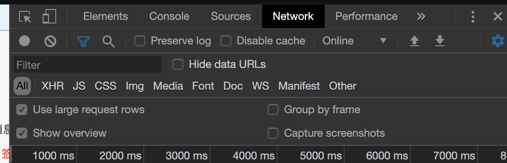
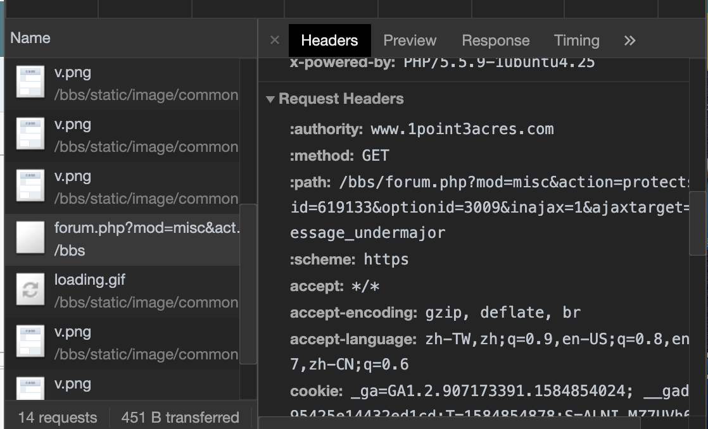

# Scrapy爬虫headers构造及带Cookie爬取

## 1 Headers构造

### 1.1 分析目标网页headers

（1）打开chrome浏览器，进入目标网页，按F12进入开发者工具，进入Network，点击左上角Filter上方圆点开始记录信息，如图所示



（2）然后刷新一次网页，可以发现Network会记录下许多信息，找到并点击name为目标页面的选项，可看到Request Headers，即我们要找的网页请求头信息




### 1.2 代码中添加headers

（1）在代码中尽量把网页headers中有的项都加上，有些网站要求把Referer也写上（Referer即当前页面来源页面），有时候Accept-Encoding加上会乱码，可不加。比较重要的是Refere即User-Agent。由于我要爬取的网站有二级页面，Referer是动态变化的，所以没有在这加上。

```python
headers = {'Accept':'text/html,application/xhtml+xml,application/xml;q=0.9,image/webp,image/apng,*/*;q=0.8,application/signed-exchange;v=b3;q=0.9',
'Accept-Language': 'zh-TW,zh;q=0.9,en-US;q=0.8,en;q=0.7,zh-CN;q=0.6',
# 'Accept-Encoding': 'gzip, deflate, br'
'User-Agent': 'Mozilla/5.0 (Macintosh; Intel Mac OS X 10_15_3) AppleWebKit/537.36 (KHTML, like Gecko) Chrome/79.0.3945.130 Safari/537.36', 
'Cookie': '_ga=GA1.2.907173391.1584854024; __gads=ID=95425e14432ed1cd:T=1584854878:S=ALNI_M'}
```


（2）用urllib库带上headers模拟请求获取响应

```python
req = urllib.request.Request(url=url, headers=headers)
res = urllib.request.urlopen(req)
xml = res.read().decode(encoding='gbk', errors='ignore')
```

在这里`urllib.request.Request()`用于构造了一个请求对象，参数url即要访问的网页url，headers即我们要带上的请求头，该方法返回一个请求对象，目的是为了模拟浏览器，防止被当作爬虫处理。

而`urllib.request.urlopen()`方法则返回了一个HTTPResposne 类型的对象，包含 read() 、 readinto() 、getheader(name) 、 getheaders() 、 fileno()的方法，详情请查询官方文档。在这里我是用`read()`方法读取了我要访问的网页内容，并通过`decode()`解码。

### 1.3 headers总结

headers即请求头，构造请求头的目的主要是为了我们在爬虫中访问网页时可以模拟浏览器行为，防止被当作爬虫处理，以及访问一些需要登陆或者是需要账号积分才能获取到所需数据的网站时必须带上请求头和Cookie才能访问（如一亩三分地论坛）。


## 2 带Cookie爬取

在Scrapy中除了在请求头带上Cookie信息的方法外，还可以把Cookie作为Request的参数

```python
yield Request(url=url, cookies=self.cookie, callback=self.parse_detail, meta={'item': item})
```

在这里我从我的一级页面的解析方法`def parse(self, response)`访问二级页面解析方法`parse_detail(self, response)`就通过在`yield Request()`中把cookie加上的方式来实现带cookie爬取。

这里要注意的是用这种方法时，需要把cookie构造为字典形式，代码如下

```python
cookie = '_ga=GA1.2.907173391.1584854024; __gads=ID=95425e14432ed1cd:T=1584854878:S=ALNI_MZ7UVh68CZhnRGLZiGXxBV-TofR2g; __cfduid=dbdfba4ff203f8478901eb99c04de96551584861606; PHPSESSID=f9h412m1o7j2huvcsk7ahlfc21; _gid=GA1.2.2131170173.1585401523; 4Oaf_61d6_saltkey=byvcvc37; 4Oaf_61d6_lastvisit=1585397946; 4Oaf_61d6_home_diymode=1; 4Oaf_61d6_atarget=1; 4Oaf_61d6_visitedfid=82; 4Oaf_61d6_auth=00458KoSZb8J66hzI%2B714%2BEwuxvgMCZOVitDAtUoX%2FdSuAAlxHoARvu580ZZKWxeRFtyIKh9G22Z%2BP2bV3G2YUS76nY; 4Oaf_61d6_lastcheckfeed=603729%7C1585413747; 4Oaf_61d6_lip=119.135.207.182%2C1585413747; 4Oaf_61d6_member_login_status=1; 4Oaf_61d6_forum_lastvisit=D_82_1585568822; 4Oaf_61d6_ulastactivity=1585575113%7C0; 4Oaf_61d6_cookie_hash=24c70647c01e756519f8068d522c1a4d; 4Oaf_61d6_viewid=tid_616854; 4Oaf_61d6_noticeTitle=1; 4Oaf_61d6_lastact=1585576344%09forum.php%09misc'
line = cookie.replace('\r', '').replace(' ', '')
line = line.split(';')
cookies = {}
for i in line:
	key, value = i.split('=', 1)
	cookies[key] = value
print(cookies)
```

此外在Scrapy中还可以通过middlewares即中间件的方式添加Cookie，感兴趣的同学自行查阅资料，在此不仅行赘述。

下期再见。