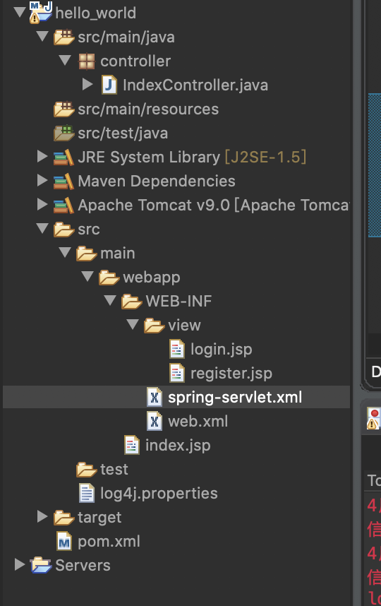
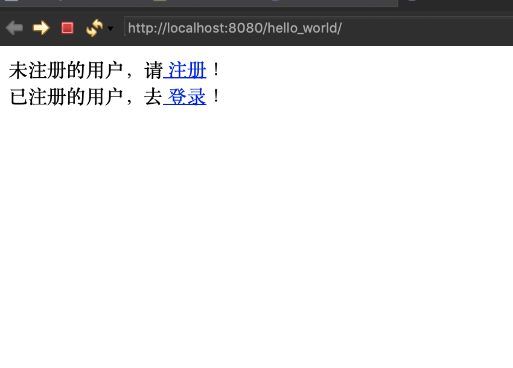

# 学习笔记3：第一个SpringMVC应用

在上一篇笔记里，我们已经搭建了第一个SpringMVC应用，并在web.xml中部署了DispatcherServlet，并在tomcat上显示出了"Hello World!"。本篇在此基础上继续完善该应用。

## 0 编写Web应用首页

在程序的`/src/main/webapp/`下有个index.jsp文件，此即为我们的Web应用首页文件，编写代码如下：

```jsp
<%@ page language="java" contentType="text/html; charset=UTF-8"
    pageEncoding="UTF-8"%>
    
<html>
<head>
<meta http-equiv="Content-Type" content="text/html; charset=UTF-8">
<title>Insert title here</title>
</head>
<body>
    未注册的用户，请<a href="${pageContext.request.contextPath }/register"> 注册</a>！
    <br/>
    已注册的用户，去<a href="${pageContext.request.contextPath }/login"> 登录</a>！
</body>
</html>
```

在这里，主要是要实现一个注册登陆的效果，并且插入了超链接，显示文字为“登陆”“注册”，用于跳转到相应页面。


## 1 创建Controller类

在 src 目录下创建 controller 包，并在该包中创建 RegisterController 和 LoginController 两个传统风格的控制器类（实现了 Controller 接口），分别处理首页中“注册”和“登录”超链接的请求。

在进行这一步之前，更新一下项目依赖，打开pom.xml，加入以下代码：

```xml
  <!--   统一版本号 -->
  <properties>
		<project.build.sourceEncoding>UTF-8</project.build.sourceEncoding>
		<spring.version>4.1.7.RELEASE</spring.version>
		<mybatis.version>3.4.5</mybatis.version>
  </properties>


  
  <dependencies>
    <dependency>
      <groupId>junit</groupId>
      <artifactId>junit</artifactId>
      <version>3.8.1</version>
      <scope>test</scope>
    </dependency>
    <!-- spring依赖 -->
	<!-- 核心包 -->
	<dependency>
		<groupId>org.springframework</groupId>
		<artifactId>spring-core</artifactId>
		<version>${spring.version}</version>
	</dependency>
		
	<!-- pring IOC的基础实现，包含访问配置文件、创建和管理bean等 -->
	<dependency>
		<groupId>org.springframework</groupId>
		<artifactId>spring-beans</artifactId>
		<version>${spring.version}</version>
	</dependency>
<!-- 这个jar文件为Spring核心提供了大量扩展。可以找到使用Spring ApplicationContext特性时所需的全部类，JDNI所需的全部类，UI方面的用来与模板（Templating）引擎如Velocity、FreeMarker、JasperReports集成的类，以及校验Validation方面的相关类。 -->
	<!-- Spring 扩展服务 -->
	<dependency>
		<groupId>org.springframework</groupId>
		<artifactId>spring-context</artifactId>
		<version>${spring.version}</version>
	</dependency>
		
<!-- 为JDBC、Hibernate、JDO、JPA等提供的一致的声明式和编程式事务管理 -->
	<dependency>
		<groupId>org.springframework</groupId>
		<artifactId>spring-tx</artifactId>
		<version>${spring.version}</version>
	</dependency>
<!-- 这个jar文件包含在应用中使用Spring的AOP特性时所需的类。使用基于AOP的Spring特性，如声明型事务管理（Declarative Transaction Management），也要在应用里包含这个jar包。 -->
	<dependency>
		<groupId>org.springframework</groupId>
		<artifactId>spring-aop</artifactId>
		<version>${spring.version}</version>
	</dependency>
		
<!-- 提供对AspectJ的支持，以便可以方便的将面向方面的功能集成进IDE中，比如Eclipse AJDT。  外部依赖。   -->
	<dependency>
		<groupId>org.springframework</groupId>
		<artifactId>spring-aspects</artifactId>
		<version>${spring.version}</version>
	</dependency>
		
<!-- springmvc依赖 -->
<!-- 这个jar文件包含Spring MVC框架相关的所有类。包含国际化、标签、Theme、视图展现的FreeMarker、JasperReports、Tiles、Velocity、XSLT相关类。当然，如果你的应用使用了独立的MVC框架，则无需这个JAR文件里的任何类。 -->
	<dependency>
		<groupId>org.springframework</groupId>
		<artifactId>spring-webmvc</artifactId>
		<version>${spring.version}</version>
	</dependency>
<!-- web依赖 -->
	<dependency>
		<groupId>org.springframework</groupId>
		<artifactId>spring-web</artifactId>
		<version>${spring.version}</version>
	</dependency>
		
<!-- jdbc支持包 -->
	<dependency>
		<groupId>org.springframework</groupId>
		<artifactId>spring-jdbc</artifactId>
		<version>${spring.version}</version>
	</dependency>
		
	 <!--mysql驱动包-->
    <dependency>
        <groupId>mysql</groupId>
        <artifactId>mysql-connector-java</artifactId>
        <version>5.1.35</version>
    </dependency>
        
    <!-- mybatis核心包 -->
    <dependency>
        <groupId>org.mybatis</groupId>
        <artifactId>mybatis</artifactId>
        <version>${mybatis.version}</version>
    </dependency>
		
<!-- 添加mybatis与Spring整合的核心包 -->
    <dependency>
        <groupId>org.mybatis</groupId>
        <artifactId>mybatis-spring</artifactId>
        <version>1.3.1</version>
    </dependency>
<!-- JSON-lib解析json字符串-->
	<dependency>
		<groupId>net.sf.json-lib</groupId>
		<artifactId>json-lib</artifactId>
		<version>2.4</version>
		<classifier>jdk15</classifier>
	</dependency>
               
<!-- servlet相关接口-->
	<dependency>
		<groupId>javax.servlet</groupId>
		<artifactId>javax.servlet-api</artifactId>
		<version>3.1.0</version>
		<scope>provided</scope>
	</dependency>
<!-- jstl标签库 -->
	<dependency>  
		<groupId>javax.servlet</groupId>  
		<artifactId>jstl</artifactId>  
		<version>1.2</version>  
 		<scope>runtime</scope>  
	</dependency> 
        
        <!-- 日志文件 -->
	<dependency>
		<groupId>log4j</groupId>
		<artifactId>log4j</artifactId>
		<version>1.2.17</version>
	</dependency>


  </dependencies>
  <build>
    <finalName>hello_world</finalName>
  </build>
</project>
```


RegisterController：

```java
package controller;

import javax.servlet.http.HttpServletRequest;
import javax.servlet.http.HttpServletResponse;
import org.springframework.web.servlet.ModelAndView;
import org.springframework.web.servlet.mvc.Controller;

public class RegisterController implements Controller {
    public ModelAndView handleRequest(HttpServletRequest arg0,
            HttpServletResponse arg1) throws Exception {
        return new ModelAndView("/WEB-INF/jsp/register.jsp");
    }
}
```

LoginController：

```java
package controller;

import javax.servlet.http.HttpServletRequest;
import javax.servlet.http.HttpServletResponse;
import org.springframework.web.servlet.ModelAndView;
import org.springframework.web.servlet.mvc.Controller;

public class LoginController implements Controller {
    public ModelAndView handleRequest(HttpServletRequest arg0,
            HttpServletResponse arg1) throws Exception {
        return new ModelAndView("/WEB-INF/jsp/login.jsp");
    }
}
```

然而这种基于传统controller类的控制器使用不方便，需要映射，于是我们直接讲解基于注解的控制器。

### 1.0 基于注解的控制器

>  传统风格的控制器不仅需要在配置文件中部署映射，而且只能编写一个处理方法，不够灵活。使用基于注解的控制器具有以下两个优点：
>
> * 在基于注解的控制器类中可以编写多个处理方法，进而可以处理多个请求（动作），这就允许将相关的操作编写在同一个控制器类中，从而减少控制器类的数量，方便以后的维护。
> * 基于注解的控制器不需要在配置文件中部署映射，仅需要使用 RequestMapping 注释类型注解一个方法进行请求处理。


在 [Spring MVC](http://c.biancheng.net/spring_mvc/) 中最重要的两个注解类型是 Controller 和 RequestMapping，本节将重点介绍它们。

#### 1.0.0 Controller 注解类型

> 在 Spring MVC 中使用 org.springframework.stereotype.Controller 注解类型声明某类的实例是一个控制器。例如，在应用的 src 目录下创建 controller 包，并在该包中创建 Controller 注解的控制器类 IndexController（可以删掉上节创建的两个控制器类，相当于在这里把两个类合并了），示例代码如下：

```java
package controller;

import org.springframework.stereotype.Controller;
import org.springframework.web.bind.annotation.RequestMapping;

@Controller//这个注解需写在类名上头，表示该类是控制器类
public class IndexController {
	@RequestMapping(value="login")//这个注释有两种类型的写法，下面将介绍
	public String login() {
		return "login";//login代表逻辑视图名称
	}
	@RequestMapping(value="register")
	public String register() {
		return "register";
	}

}
```

在 Spring MVC 中使用扫描机制找到应用中所有基于注解的控制器类，所以，为了让控制器类被 Spring MVC 框架扫描到，需要在配置文件中声明 spring-context，并使用 <context：component-scan/> 元素指定控制器类的基本包（请确保所有控制器类都在基本包及其子包下）。

在WEB-INF/spring-servlet.xml中加入以下配置：

```xml
<!-- 配置扫描的包 -->
    <context:component-scan base-package="controller" />
```

#### 1.0.1 RequestMapping 注解类型

在基于注解的控制器类中可以为每个请求编写对应的处理方法。那么如何将请求与处理方法一一对应呢？

需要使用 org.springframework.web.bind.annotation.RequestMapping 注解类型将请求与处理方法一一对应。

```java
@Controller
public class IndexController {
    @RequestMapping(value = "/index/login")
    public String login() {
        /**
         * login代表逻辑视图名称，需要根据Spring MVC配置
         * 文件中internalResourceViewResolver的前缀和后缀找到对应的物理视图
         */
        return "login";
    }
    @RequestMapping(value = "/index/register")
    public String register() {
        return "register";
    }
}
```

上述示例中有两个 RequestMapping 注解语句，它们都作用在处理方法上。注解的 value 属性将请求 URI 映射到方法，value 属性是 RequestMapping 注解的默认属性，如果只有一个 value 属性，则可以省略该属性。

在类级别注解的情况下，控制器类中的所有方法都将映射为类级别的请求。用户可以使用如下 URL 访问 login 方法。

`http://localhost:8080/项目名称/login`

## 2 运行程序

在 "0 编写Web应用首页"中一节中编写的超链接中使用了`${pageContext.request.contextPath }`方法去获取绝对路径，然而在本人运行中出错，无法正确解析，后续有精力再解决该问题。

于是我把其改为如下代码：

```jsp
<body>
    未注册的用户，请<a href="/hello_world/register"> 注册</a>！
    <br/>
    已注册的用户，去<a href="/hello_world/login"> 登录</a>！
</body>
```

此处的`/hello_world`是我的项目名称，各位需要根据自己项目更改。

另外补充一点，在`spring-servlet.xml`中是需要声明视图解析器的，代码如下：

```xml
<!-- 视图解析器 -->
    <bean
        class="org.springframework.web.servlet.view.InternalResourceViewResolver">
        <property name="prefix" value="/WEB-INF/view/"></property>
        <property name="suffix" value=".jsp"></property>
    </bean>
```

这里的两个value分别是前缀和后缀，各位需要根据自己目录结构去更改，本人的项目目录如下图：



最后运行如下：



点击"登陆"：


附上本人login.jsp代码如下：

```jsp
<%@ page language="java" contentType="text/html; charset=UTF-8"
    pageEncoding="UTF-8"%>
    
<html>
<head>
<meta http-equiv="Content-Type" content="text/html; charset=UTF-8">
<title>Insert title here</title>
</head>
<body>
	<h1>登陆页面</h1>
</body>
</html>
```


下期再见。