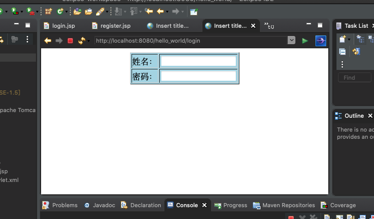

# SpringMVC学习笔记4：获取参数

> Controller 接收请求参数的方式有很多种，有的适合 get 请求方式，有的适合 post 请求方式，有的两者都适合。下面分别介绍这些方式，读者可以根据实际情况选择合适的接收方式。

PS：本系列教程默认读者有Java基础。

## 0 通过实体 Bean 接收请求参数

> 通过一个实体 Bean 来接收请求参数，适用于 get 和 post 提交请求方式。需要注意的是，Bean 的属性名称必须与请求参数名称相同。下面通过具体项目讲解“通过实体 Bean 接收请求参数”。

### 0.0 完善配置文件

在sprimg-servlet.xml中加入如下代码：

```xml
<!-- 使用扫描机制扫描控制器类，控制器类都在controller包及其子包下 -->
    <context:component-scan base-package="controller" />
    <mvc:annotation-driven />
    <!-- annotation-driven用于简化开发的配置，注解DefaultAnnotationHandlerMapping和AnnotationMethodHandlerAdapter -->
    <!-- 使用resources过滤掉不需要dispatcherservlet的资源（即静态资源，例如css、js、html、images）。
        在使用resources时必须使用annotation-driven，否则resources元素会阻止任意控制器被调用 -->
    <!-- 允许css目录下的所有文件可见 -->
    <mvc:resources location="/css/" mapping="/css/**" />
    <!-- 允许html目录下的所有文件可见 -->
    <mvc:resources location="/html/" mapping="/html/**" />
    <!-- 允许css目录下的所有文件可见 -->
    <mvc:resources location="/images/" mapping="/images/**" />
    <!-- 完成视图的对应 -->
    <!-- 对转向页面的路径解析。prefix：前缀， suffix：后缀 -->
    <bean
        class="org.springframework.web.servlet.view.InternalResourceViewResolver">
        <property name="prefix" value="/WEB-INF/jsp/" />
        <property name="suffix" value=".jsp" />
    </bean>
```


### 0.1 创建POJO实体类

在 项目的 src 目录下创建 pojo 包，并在该包中创建实体类 UserForm，代码如下：

```java
package POJO;

public class UserForm {
	private String uname;
	private String upass;
	private String reupass;
  
  public String getUname() {
		return uname;
	}
	public String getUpass() {
		return upass;
	}

}
```


### 0.2 添加控制器类

在 项目的 controller 包中创建控制器类 IndexController 和 UserController，其中IndexController在上一篇笔记中已经创建过。

UserController代码如下：

```java
package controller;

import javax.servlet.http.HttpSession;
import org.springframework.stereotype.Controller;
import org.springframework.ui.Model;
import org.springframework.web.bind.annotation.RequestMapping;
import pojo.UserForm;
import org.apache.commons.logging.Log;
import org.apache.commons.logging.LogFactory;

@Controller
@RequestMapping("/user")
public class UserController {
    // 得到一个用来记录日志的对象，这样在打印信息的时候能够标记打印的是哪个类的信息
    private static final Log logger = LogFactory.getLog(UserController.class);
    /**
     * 处理登录 使用UserForm对象(实体Bean) user接收注册页面提交的请求参数
     */
    @RequestMapping("/login")
    public String login(UserForm user, HttpSession session, Model model) {
        if ("zhangsan".equals(user.getUname())
                && "123456".equals(user.getUpass())) {
            session.setAttribute("u", user);
            logger.info("成功");
            return "main"; // 登录成功，跳转到 main.jsp
        } else {
            logger.info("失败");
            model.addAttribute("messageError", "用户名或密码错误");
            return "login";
        }
    }
    /**
     * 处理注册 使用UserForm对象(实体Bean) user接收注册页面提交的请求参数
     */
    @RequestMapping("/register")
    public String register(UserForm user, Model model) {
        if ("zhangsan".equals(user.getUname())
                && "123456".equals(user.getUpass())) {
            logger.info("成功");
            return "login"; // 注册成功，跳转到 login.jsp
        } else {
            logger.info("失败");
            // 在register.jsp页面上可以使用EL表达式取出model的uname值
            model.addAttribute("uname", user.getUname());
            return "register"; // 返回 register.jsp
        }
    }
}
```

如果未安装org.apache.commons包（主要用于记录日志）的话，进入pom.xml添加一下依赖：

```xml
<dependency>
    	<groupId>commons-logging</groupId>  
    	<artifactId>commons-logging</artifactId>  
    	<version>1.2</version>  
</dependency>
```


### 0.3 修改页面视图

修改之前创建的login.jsp以及register.jsp文件，代码如下：

register.jsp:

```jsp
<%@ page language="java" contentType="text/html; charset=UTF-8"
    pageEncoding="UTF-8"%>
    
<html>
<head>
<meta http-equiv="Content-Type" content="text/html; charset=UTF-8">
<title>Insert title here</title>
</head>
<body>
	<form action="/hello_world/user/register" method="post" name="registForm">
        <table border=1 bgcolor="lightblue" align="center">
            <tr>
                <td>姓名：</td>
                <td>
                    <input class="textSize" type="text" name="uname" value="${uname }" />
                </td>
            </tr>
            <tr>
                <td>密码：</td>
                <td>
                    <input class="textSize" type="password" maxlength="20" name="upass" />
                </td>
            </tr>
            <tr>
                <td>确认密码：</td>
                <td>
                    <input class="textSize" type="password" maxlength="20" name="reupass" />
                </td>
            </tr>
            <tr>
                <td colspan="2" align="center">
                    <input type="button" value="注册" onclick="allIsNull() " />
                </td>
            </tr>
        </tab1e>
    </form>
</body>
</html>
```

login.jsp:

```jsp
<%@ page language="java" contentType="text/html; charset=UTF-8"
    pageEncoding="UTF-8"%>
    
<html>
<head>
<meta http-equiv="Content-Type" content="text/html; charset=UTF-8">
<title>Insert title here</title>
</head>
<body>
	<form action="/hello_world/user/login" method="post">
        <table border=1 bgcolor="lightblue" align="center">
            
            <tr>
                <td>姓名：</td>
                <td>
                    <input type="text" name="uname" class="textSize">
                </td>
            </tr>
            <tr>
                <td>密码：</td>
                <td>
                    <input type="password" name="upass" class="textsize">
                </td>
            </tr>
            
        </table>
        
    </form>
</body>
</html>
```


### 0.4 运行程序

Run on Server：




### 0.5 总结

首先要明确一下什么是实体bean。

想必大家都知道JavaBean大致可以理解为一个符合以下特性的类：

* 所有属性为private
* 提供默认构造方法
* 提供getter和setter
* 实现serializable接口

那么在本例里的UserForm就是一个实体bean，简单笼统的说，它是一个可复用的类。

javaBean在MVC设计模型中是model，又称模型层，在一般的程序中，我们称它为数据层，就是用来设置数据的属性和一些行为，然后我会提供获取属性和设置属性的get/set方法JavaBean是一种JAVA语言写成的可重用组件。为写成JavaBean，类必须是具体的和公共的，并且具有无参数的构造器。

JavaBean通过提供符合一致性设计模式的公共方法将内部域暴露成员属性。众所周知，属性名称符合这种模式，其他Java类可以通过自身机制发现和操作这些JavaBean 属性。

用户可以使用JavaBean将功能、处理、值、数据库访问和其他任何可以用java代码创造的对象进行打包，并且其他的开发者可以通过内部的JSP页面、Servlet、其他JavaBean、applet程序或者应用来使用这些对象。用户可以认为JavaBean提供了一种随时随地的复制和粘贴的功能，而不用关心任何改变。

JavaBean可分为两种：一种是有用户界面（UI，User Interface）的JavaBean；还有一种是没有用户界面，主要负责处理事务（如数据运算，操纵数据库）的JavaBean。JSP通常访问的是后一种JavaBean。

这样就很好理解了，在本例中就是通过这样一个实体bean来达到接收参数的目的。

不理解的再好好琢磨一下代码，在此不多赘述了。


## 1 通过 HttpServletRequest 接收请求参数

> 通过 HttpServletRequest 接收请求参数适用于 get 和 post 提交请求方式，可以将“通过实体 Bean 接收请求参数”部分中控制器类 UserController 中 register 方法的代码修改如下：

```java
@RequestMapping("/register")
/**
* 通过HttpServletRequest接收请求参数
*/
public String register(HttpServletRequest request,Model model) {
    String uname = request.getParameter("uname");
    String upass = request.getParameter("upass");
    if ("zhangsan".equals(uname)
            && "123456".equals(upass)) {
        logger.info("成功");
        return "login"; // 注册成功，跳转到 login.jsp
    } else {
        logger.info("失败");
        // 在register.jsp页面上可以使用EL表达式取出model的uname值
        model.addAttribute("uname", uname);
        return "register"; // 返回 register.jsp
    }
}
```


## 2 通过处理方法的形参接收请求参数

> 通过处理方法的形参接收请求参数也就是直接把表单参数写在控制器类相应方法的形参中，即形参名称与请求参数名称完全相同。该接收参数方式适用于 get 和 post 提交请求方式。用户可以将“通过实体 Bean 接收请求参数”部分中控制器类 UserController 中 register 方法的代码修改如下：

```java
@RequestMapping("/register")
/**
* 通过形参接收请求参数，形参名称与请求参数名称完全相同
*/
public String register(String uname,String upass,Model model) {
    if ("zhangsan".equals(uname)
            && "123456".equals(upass)) {
        logger.info("成功");
        return "login"; // 注册成功，跳转到 login.jsp
    } else {
        logger.info("失败");
        // 在register.jsp页面上可以使用EL表达式取出model的uname值
        model.addAttribute("uname", uname);
        return "register"; // 返回 register.jsp
    }
}
```

其余还有`通过 @ModelAttribute 接收请求参数`、`通过 @RequestParam 接收请求参数`、`通过 @PathVariable 接收 URL 中的请求参数`等方法，在此不过多进行介绍，感兴趣的同学自行查阅文档，后续有使用需求再进行讲解介绍。

另外，1-2节代码本人未亲自验证，有实践精神的同学自行验证自行Debug。

下期再见。