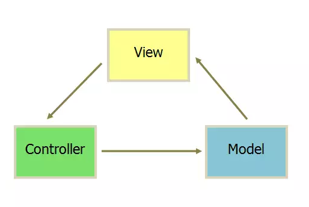
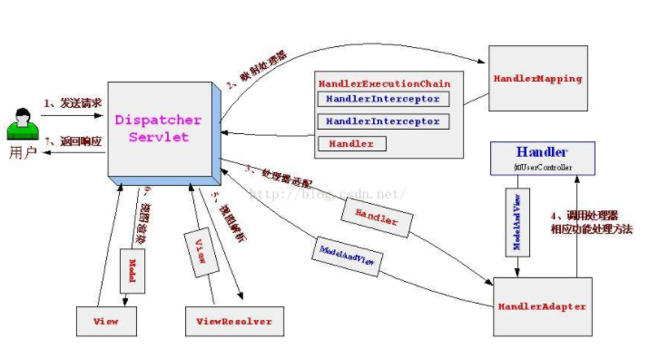

## 0 SpringMVC是什么

SpringMVC，即Spring Web MVC，简单而言，就是一种基于Java的实现了Web MVC设计模式的请求驱动类型的轻量级Web框架。

### 0.0 MVC是什么

MVC是一种设计模式，即Model-View-Controller(MVC)，如字面意思所示，这种模式将应用程序分离为了三个模块，这样业务逻辑与界面代码完成了解耦，好处很明显，这样在开发的过程中，对界面的改动或者是对业务逻辑的改动会方便很多，不会像耦合在一起的时候那样，牵一发而动全身，改一个小功能需要对多处进行大量改动。（PS：类似Model-View-ViewModel模式的目的。）

具体来说，通常Model负责封装应用程序数据在视图层展示；视图仅仅负责展示，并不包含任何业务逻辑；控制器负责接收来自用户的请求，并调用后台服务来处理业务逻辑。处理后，后台业务层可能会返回了一些数据在视图层展示。控制器收集这些数据及准备模型在视图层展示。MVC模式的核心思想是将业务逻辑从界面中分离出来，允许它们单独改变而不会相互影响。

## 1 SpringMVC架构及工作流程

### 1.0 核心架构及处理流程

核心架构的具体流程步骤如下：
  1、首先用户发送请求——>DispatcherServlet，前端控制器收到请求后自己不进行处理，而是委托给其他的解析器进行处理，作为统一访问点，进行全局的流程控制；
  2、DispatcherServlet——>HandlerMapping， HandlerMapping将会把请求映射为HandlerExecutionChain对象（包含一个Handler处理器（页面控制器）对象、多个HandlerInterceptor拦截器）对象，通过这种策略模式，很容易添加新的映射策略；
  3、DispatcherServlet——>HandlerAdapter，HandlerAdapter将会把处理器包装为适配器，从而支持多种类型的处理器，即适配器设计模式的应用，从而很容易支持很多类型的处理器；
  4、HandlerAdapter——>处理器功能处理方法的调用，HandlerAdapter将会根据适配的结果调用真正的处理器的功能处理方法，完成功能处理；并返回一个ModelAndView对象（包含模型数据、逻辑视图名）；
  5、ModelAndView的逻辑视图名——> ViewResolver， ViewResolver将把逻辑视图名解析为具体的View，通过这种策略模式，很容易更换其他视图技术；
  6、View——>渲染，View会根据传进来的Model模型数据进行渲染，此处的Model实际是一个Map数据结构，因此很容易支持其他视图技术；
  7、返回控制权给DispatcherServlet，由DispatcherServlet返回响应给用户，到此一个流程结束。
  此处我们只是讲了核心流程，没有考虑拦截器、本地解析、文件上传解析等。

### 1.1 该架构下的优势

> 1、清晰的角色划分：前端控制器（DispatcherServlet）、请求到处理器映射（HandlerMapping）、处理器适配器（HandlerAdapter）、视图解析器（ViewResolver）、处理器或页面控制器（Controller）、验证器（ Validator）、命令对象（Command 请求参数绑定到的对象就叫命令对象）、表单对象（Form Object 提供给表单展示和提交到的对象就叫表单对象）。
>   2、分工明确，而且扩展点相当灵活，可以很容易扩展，虽然几乎不需要；
>   3、由于命令对象就是一个POJO，无需继承框架特定API，可以使用命令对象直接作为业务对象；
>   4、和Spring 其他框架无缝集成，是其它Web框架所不具备的；
>   5、可适配，通过HandlerAdapter可以支持任意的类作为处理器；
>   6、可定制性，HandlerMapping、ViewResolver等能够非常简单的定制；
>   7、功能强大的数据验证、格式化、绑定机制；
>   8、利用Spring提供的Mock对象能够非常简单的进行Web层单元测试；
>   9、本地化、主题的解析的支持，使我们更容易进行国际化和主题的切换。
>  10、强大的JSP标签库，使JSP编写更容易。
> 
>

下篇再对SpringMVC进行安装配置、使用。