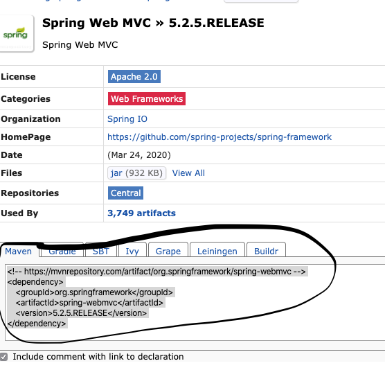
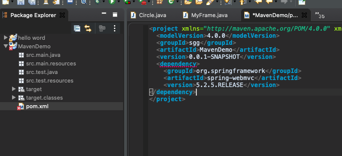

# SpringMVC学习笔记1：环境

本篇笔记介绍MacOS X操作系统下配置SpringMVC的依赖环境及安装SpringMVC。

## 0 依赖环境的配置

### 0.1 eclipse下载&安装

* 进入eclipse官网下载最新版本eclipse：[eclipse官网链接](https://www.eclipse.org/)

* 下载完成后安装时选择`Eclipse IDE for Java EE Developers`，等待安装完成配置好jdk即可。（未下载jdk的自行下载，在此不赘述。）


### 0.2 tomcat下载配置

* 进入tomcat官网下载所需版本tomcat包即可：[tomcat官网链接](http://tomcat.apache.org/)

* 下载好后解压放在自己想要的文件目录下，然后在eclipse中配置tomcat：`Eclipse->Preferences->Server->Runtime Environments`，点击`Add`，选择自己的tomcat版本，点击`Next`，点击`Browse`，选择自己tomcat的解压路径：

  

  完成后点击`Finish`。


### 0.3 Maven下载配置

Maven是一个项目管理工具，在Maven里可以方便的安装添加SpringMVC。

在官网下载需要版本的包：[Maven官网](http://maven.apache.org/download.cgi)

解压放在自己的目录里。接下来配置Java即Maven环境，笔者为MacOS X系统。

#### 0.3.1 配置JAVA_HOME

终端输入：

```shell
cd ~
touch .zshrc  # bash的话touch .bash_profile(已创建跳过)
vim .zshrc
# insert模式输入：
	export JAVA_HOME='这里填jdk的路径'
  export PATH=${JAVA_HOME}/bin:$PATH
# 按esc退出insert模式，输入：
:wq
# 即可保存退出
source .zshrc
# 判断是否配置成功，输出刚才路径则说明成功
echo $JAVA_HOME
```


#### 0.3.2 配置Maven环境

终端输入：

```shell
vim ~/.zshrc
# insert
	export MAVEN_HOME='这里填MAVEN的文件路径'
	export PATH=${MAVEN_HOME}/bin:$PATH
# esc退出insert，输入：
:wq
# 即可保存退出
source ~/.zshrc
#查看是否配置好
mvn -v
```


## 1 导入Spring Web MVC包依赖

进入Maven中央仓库找到Spring Web MVC：[Maven中央仓库](https://mvnrepository.com/artifact/org.springframework/spring-webmvc/5.2.5.RELEASE)

复制代码：



在Eclipse中创建Maven工程，在工程的pom.xml中加入复制的代码




如无意外，到此就配置好了，下一篇我们将进入正式学习。