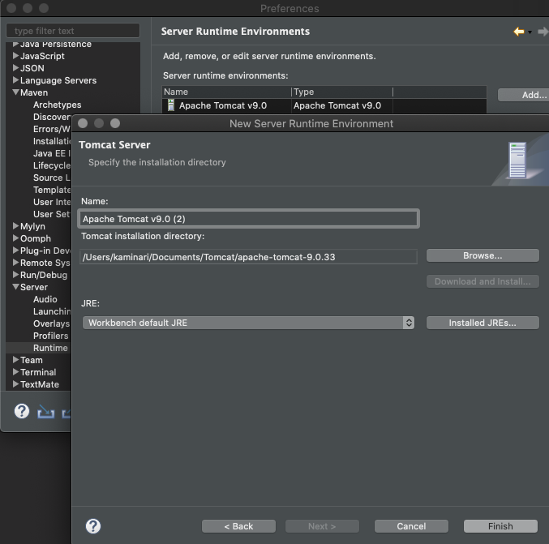

# SpringMVC学习笔记1：环境

本篇笔记介绍Mac OSX操作系统下配置SpringMVC的依赖环境及安装SpringMVC。

## 0 依赖环境的配置

### 0.1 eclipse下载&安装

* 进入eclipse官网下载最新版本eclipse：[eclipse官网链接](https://www.eclipse.org/)

* 下载完成后安装时选择`Eclipse IDE for Java EE Developers`，等待安装完成配置好jdk即可。（未下载jdk的自行下载，在此不赘述。）

### 0.2 tomcat下载配置

* 进入tomcat官网下载所需版本tomcat包即可：[tomcat官网链接](http://tomcat.apache.org/)

* 下载好后解压放在自己想要的文件目录下，然后在eclipse中配置tomcat：`Eclipse->Preferences->Server->Runtime Environments`，点击`Add`，选择自己的tomcat版本，点击`Next`，点击`Browse`，选择自己tomcat的解压路径：

  

  完成后点击`Finish`。

### 0.3 Maven下载配置

Maven是一个项目管理工具，在Maven里可以方便的安装添加SpringMVC。

未完待续。

