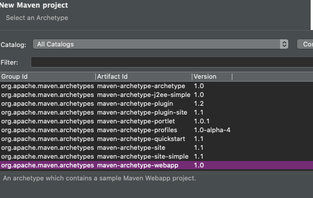
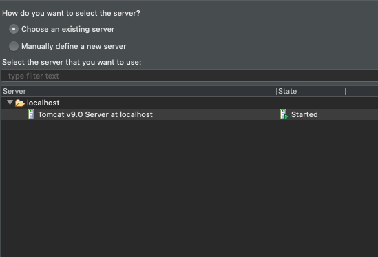
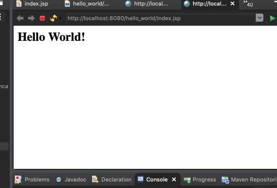

# SpringMVC学习笔记2：Hello World!

## 0 通过Maven创建SpringMVC项目

* 进入Eclipse，`File->New->Other->Maven Project->Next->Next`，此时进入选择Maven Archetype界面：

  

  如果界面是空白的莫慌，稍等几分钟加载就好，如果很久都不好，请自行解决。点`Next`，输入以下信息：

  `Group Id: 通常为公司域名反过来，可以随便输；Artifact Id: 项目名称；其他: 默认`，`Finish`，创建完成。

* 此时项目src会报错，原因是找不到HttpServlet类，可以通过导入tomcat到工作目录解决：`右键项目名称->Build Path->Configure Build Path->Java Build Path->Libraries->Add Library->Server Runtime->Next`，选择之前配置的tomcat即可，更新设置后就创建好项目了。

* 编辑web.xml文件，web.xml文件的具体作用、配置方法不赘述，代码如下：

  ``` xml
  <!DOCTYPE web-app PUBLIC
   "-//Sun Microsystems, Inc.//DTD Web Application 2.3//EN"
   "http://java.sun.com/dtd/web-app_2_3.dtd" >
  
  <web-app>
    <display-name>Archetype Created Web Application</display-name>
    <servlet>
    	<servlet-name>spring</servlet-name>
    	<servlet-class>org.springframework.web.servlet.DispatcherServlet</servlet-class>
    </servlet>
    
    <servlet-mapping>
    	<servlet-name>spring</servlet-name>
    	<url-pattern>/</url-pattern>
    </servlet-mapping>
  </web-app>
  ```


## 1 运行Hello Word

* 点击运行，选择之前配置的Server：

  

  `Next`。

* 运行方式选择在Server运行，可以看到如下界面就说明成功了：

  


下期再见。


