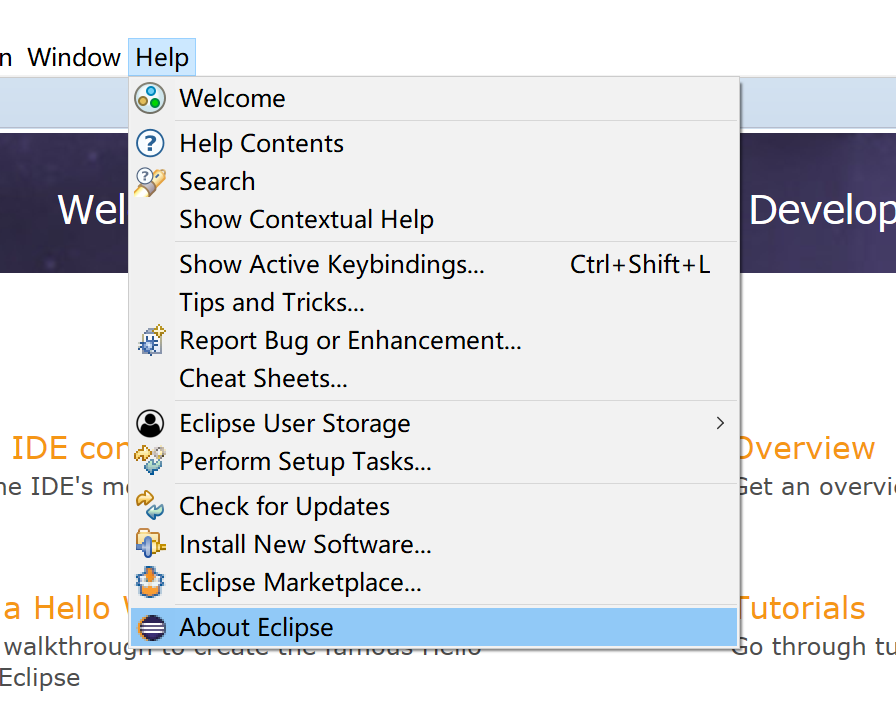

# Spring学习笔记2

> 作者：DZF
> 邮箱：872573678@qq.com

## 简介

* 本次笔记主要记录如何安装Spring框架
* 默认读者已成功安装了java与eclipse
* 默认读者已具备java编程基础

## 1. 安装springsource-tool-suite

* **查看eclipse版本**

> help--About Eclipse

* **使用eclipse安装对应的springsource-tool-suite**

> help--Install New Software

* **选择对应版本下载**

> 链接http://dist.springsource.com/release/TOOLS/update/xxx/
>
> 其中xxx为eclipse的版本号

> 安装对应的插件

## 2. 下载Spring framework

* **选择合适的版本下载**

> 链接：https://repo.spring.io/release/org/springframework/spring/5.2.5.RELEASE/

* **下载完解压framework**

## 3. 下载Common Logging

## 4. 建一个Spring工程

* **新建java工程**

* **右击刚才创建的项目，"New"-->"Folder"新建文件夹，并命名为“lib”,"Finish"**

* **把几个jar添加进lib中**

> 来自解压后的framework与common logging

> 从eclipse粘贴进lib

* **然后选中5个jar包，右键--"bulid path"--"add to build path"**

