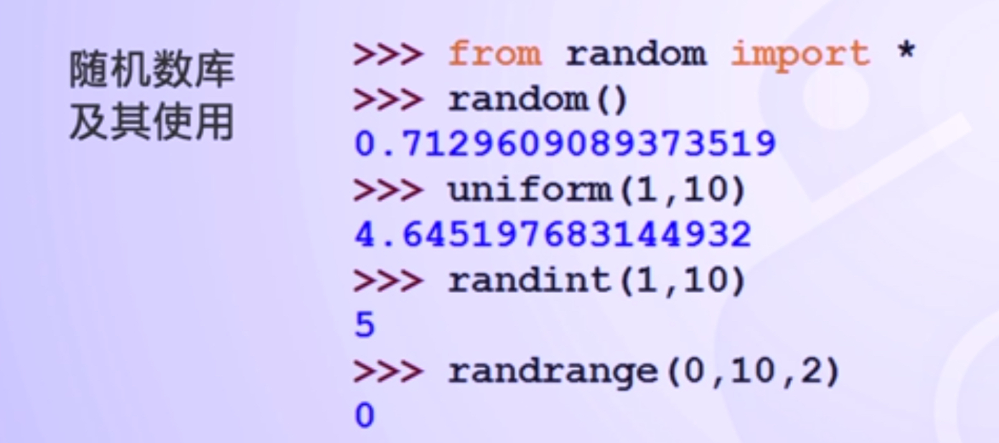

#1.math库与random库

#2.π的计算

1. 圆周率π是一个无理数，没有任何一个精确公式能够计算π值，π的计算只能采用近似算法；
2. 国际公认的π值计算采用蒙特卡洛方法；
3. 蒙特卡洛方法，又称随机抽样或统计试验方法。当所求解的问题是某种事件出现的概率，或某随机变量的期望值时，可以通过某种“实验”的方法求解。
4. 简单说，蒙特卡洛是利用随机试验求解问题的方法

【π计算问题的IPO】

1. 输入：抛点的数量；
2. 处理：对于每个抛洒点，计算点到圆心的距离，通过距离判断该点在圆内或者是圆外。统计在圆内点的数量；
3. 输出：π值

4. 

5. 

