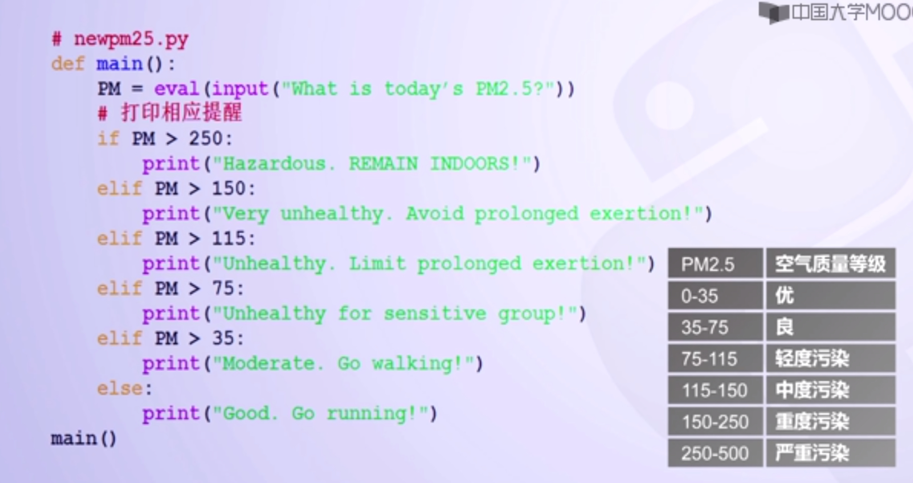

#1.多分支

【多分支决策】

1. 要解决双根问题，就需要对delta等于0的情况进行处理。语句的结构上要引入嵌套结构。
2. 当delta<0,处理无实根情况；
3. 当delta=0,处理实根情况；
4. 当delta>0,处理双根情况；
5. 一种解决方案是在程序中使用两个if-else语句；
6. 把一个复合语句放到另一个语句的结构之中成为嵌套。

【多分支决策】

1. 多分支决策是解决复杂问题的重要手段之一；
2. 一个三分支决策可以由两个二分支结构嵌套实现；
3. 使用if-else描述多分支决策时，实现更多分支需要更多嵌套，影响程序的易读性；
4. python使用if-elif-else描述多分支决策，简化分支结构的嵌套问题。

改进后的程序流程图

