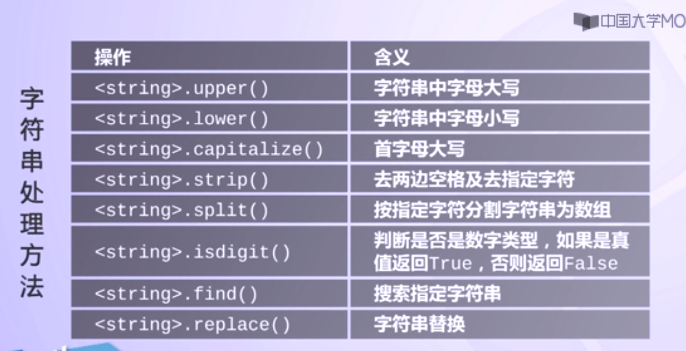
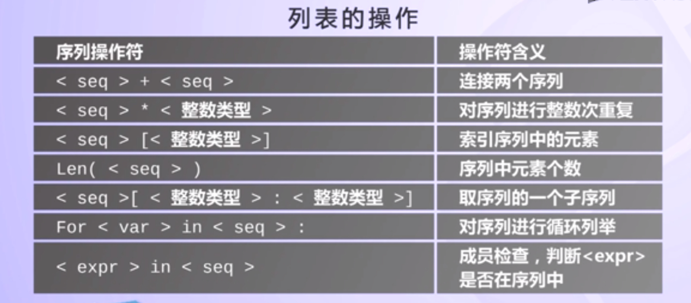
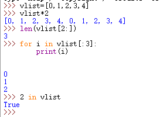
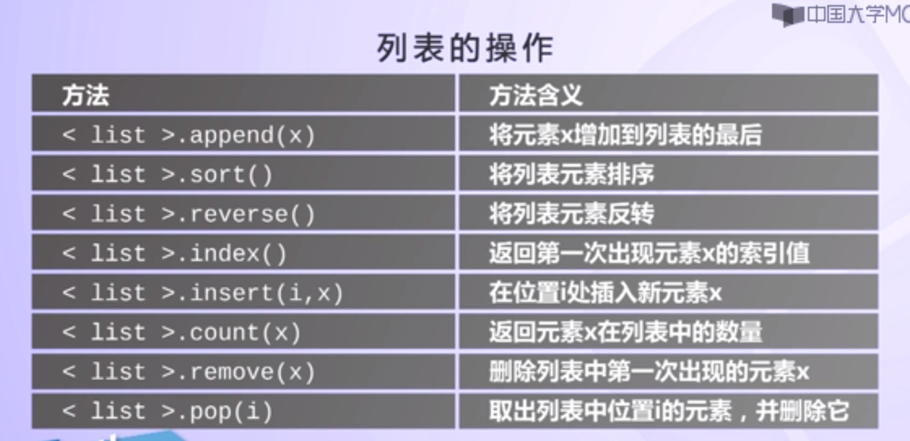
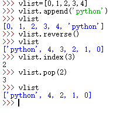
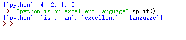

【字符串的操作】

字符串操作方法采用格式：
<string>.func()

遍历字符串中每个字符

转义符可以在字符串中表达一些不可直接打印的信息。
【例】：用\n表示换行
1. 字符串"Hello\nWorld\n\nGoodbye 32\n"
2. 用print()函数打印后的输出效果如下：
  Hello
  World

  Goodbye 32

【元组的类型】

1. 元组是包含多个元素的类型，元素之间用逗号分隔，如：t1=123,456,"hello"
2. 元组可以是空的，t2=（）
3. 元组包含一个元素：t3=123，
4. 元组外侧可以使用括号，也可以不使用。

【元组由三个特点】

1. 元组中元素可以是不同类型；例如：t3=123，456，（"hello","中国")
2. 元组中各元素存在先后关系，可以通过索引访问元组中元素；例如：t3[0]
3. 元组定义后不能更改，也不能删除；例如：t3[0]=456.

【元组的概念】

1. 与字符串类型类似，可以通过索引区间来访问元组中部分元素。t[1:]
2. 与字符串一样，元组之间可以使用+号和*号进行运算。

【列表的概念】

1. 列表（list）是有序的元素集合；
2. 列表元素可以通过索引访问单个元素

    >>>a=[0,1,2,3,4,5,6,7,8,9]
    >>>print(a)
    [0,1,2,3,4,5,6,7,8,9]
    >>>
1. 列表与元组类似：①列表中每个元素类型可以不一样；②访问列表中元素时采用索引形式；
2. 列表与元组不同不同：①列表的大小没有限制可随时修改

【其他操作】

【例子】

【列表的操作】
字符串可以通过split（）函数，将字符串拆分成一个列表。
例如：

  
 

