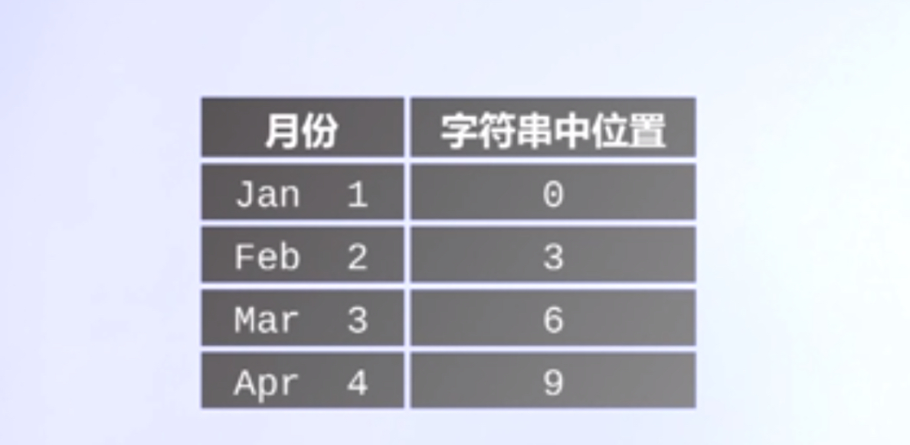
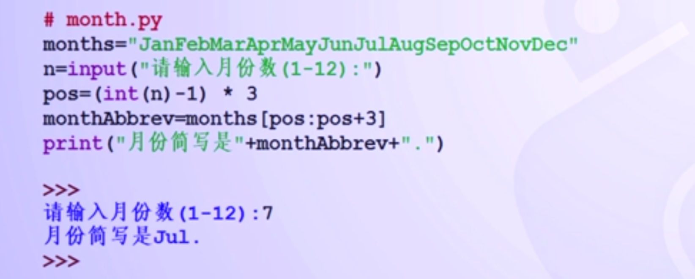

【字符串类型】

1.字符串是用双引号“”或者单引号''括起来的一个或多个字符。
    >>>str1="Hello"
    >>>str2='John'

2.字符串可以保存在变量中，也可以单独存在。
3.可以用type（）函数测试一个字符串的类型。
    >>>type(str1)
    <class'str'>
4.python语言转义符：\
5.输出带有引号的字符串，可以使用转义符；
    >>>print("\大家好\"")
    "大家好“
    >>>
6.使用\\可以输出带有转义符的字符串；

【字符串数据类型】

字符串是一个字符序列：字符串最左端位置标记为0，依次增加。字符串中的编号叫做"索引"

1. 单个索引辅助访问字符串中的特定位置；

1. python中的字符串索引从0开始，一个长度为L的字符串最后一个字符的位置是L-1；
2. python同时允许使用负数从字符串右边末尾向左边进行反向索引，最右侧索引值是-1.
    >>>greet[-4]
    'J'
    >>>

【字符串数据类型】

1.此外，也可以通过两个索引值确定一个位置范围内，返回这个范围的子串；

2.start和end都是整数型数值，这个子序列从索引start开始直到索引end结束，但不包括end位置；
    >>>greet[0:3]
    'Hel'
    >>>

【字符串数据类型】字符串之间可以通过+或*进行连接

1. 加法操作（+）将两个字符串连接成为一个新的字符串
    >>>"pine"+"apple"
    'pineapple'
1. 乘法操作（*）构建一个由其本身字符串重复链接而成的字符串
    >>>3*"pine"
    'pinepinepine'
    >>>
 
【字符串数据类型】

1. len（）函数能够返回一个字符串的长度
    >>>len("pine")
    4
    >>>len("祖国，您好！“）
    6
1. 大多数数据类型都可以通过str()函数转换为字符串
    >>>str(123)
    '123'
    >>>str(123.345)
    '123.456'
    >>>str(123e+10)
    '1230000000000.0'

【字符串使用实例】

输入一个月份数字，返回对应月份名称缩写。

IPO模式是：

输入：输入一个表示月份的数字（1-12）

处理：利用礼服穿基本操作实现该功能

输出：输入数字对应月份名称的缩写

将所有的月份名称缩写存储在字符串中

mouths="JanFebMarAprMayJunJulAugSepOctNovDec"

在字符串中截取适当的子串来查找特定月份
 
1. 找出在哪里切割子串；
2. 每个月份的缩写都由3个字母组成，如果pos表示一份月份的第一个字母，则mouths[pos:pos+3]表示这个月份的缩写，即：mouthAbbrev=mouths[pos:pos+3]
3. 

程序代码如下：

