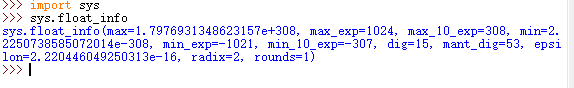
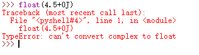
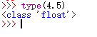
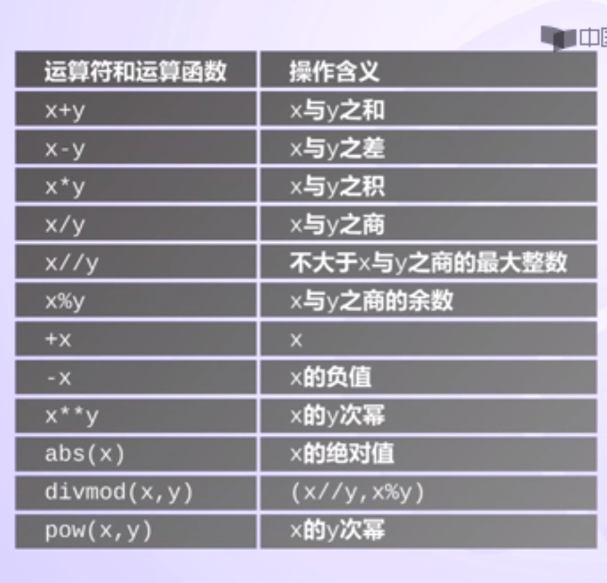

#1.数据的类型

1. 类型是编程语言对数据的一种划分。
2. python语言的类型：数字类型、字符串类型、元组类型、列表类型、文件类型、字典类型

【数字类型】

1.程序元素：010/10，存在多种可能
 ①表示十进制数值10②类似人名字一样的字符串

2.数学类型对python语言中数字的表示和使用进行了定义和规范

python包括三种数字类型：整数类型、浮点数类型、复数类型

【整数类型】

1. 与数学中的整数概念一致，没有取值范围限制
2. pow（x,y)函数：计算x^y
3. 打开IDLE
4. 程序1：pow（2，10）=1024，pow（2，15）=32768
5. 程序2：pow（2，1000）
6. 程序3：pow（2，pow（2，15））
7. 示例
    1010，99，-217
    0x9a,-0X89(0x,0X开头表示16进制数）
    0b010，-0B101（0b，0B开头表示2进制数）
    0o123，-0O456（0o，0O开头表示8进制数）

【浮点数类型】

1. 带有小数点及小数的数字
2. python语言中浮点数的数值范围存在限制，小数精度也存在限制，这种限制与不同计算机系统有关。

【示例】
1. 0.0，-77.，-2.17
2. 96e4,4.3e-3,9.6E5(科学记数法）
3. 科学记数法使用字母"e"或者"E"作为幂的符号，以10为基数；科学记数法含义如：

【复数类型】

1. 与数学中的复数概念一致，Z=A+BJ，A是实数部分，B是虚数部分，A和B都是浮点类型，虚数部分用J或者J标识**
2. 示例：12.3+4j，-5.6+7j
3. z=1.23e-4+5.6e+89j
  对于复数z，可用z.real获得实数部分，z.imag获得虚数部分
  z.real=0.000123 z.imag=5.6e+89

【数字类型的关系】

1. 三种类型存在一种逐渐“扩展”的关系：
  整数->浮点数->复数（整数是浮点数特例，浮点数是复数特例）

1.  不同数字类型之间可以进行混合运算，运算后生成结果为最宽类型
2.  示例：123+4.0=127.0（整数+浮点数=浮点数）
3. 三种数字类型可以进行相互转换：：int（）将x变成整数；float（）将x变成浮点数，complex（）将x变成复数
4. 示例：int（4.5）=4（直接去掉小数部分）、float（4）=4.0（增加小数部分）、complex（4）=4+0J
5. 示例：complex（4.5）=4.5+0j

【数字类型的判断】

1. 函数：type（x）返回x的类型，适合于所有类型的判断
2. 示例：

【应用】

