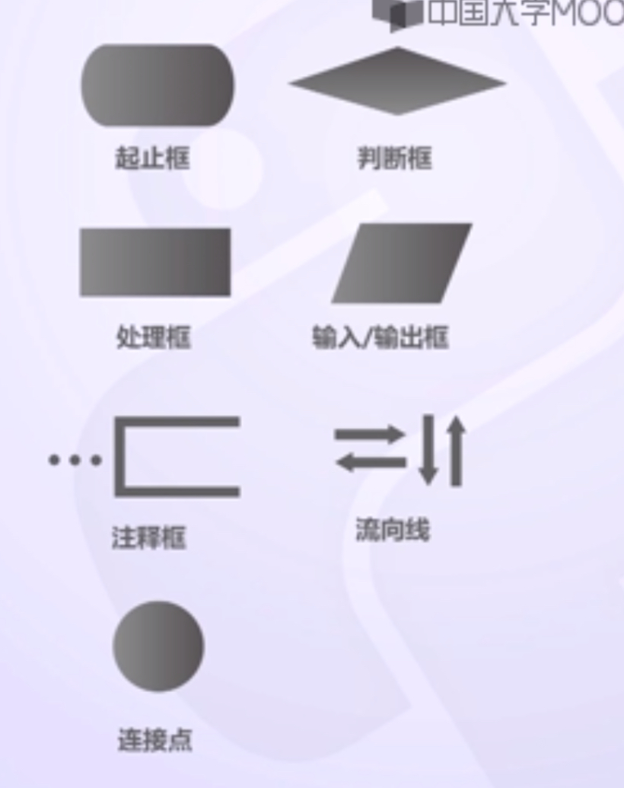
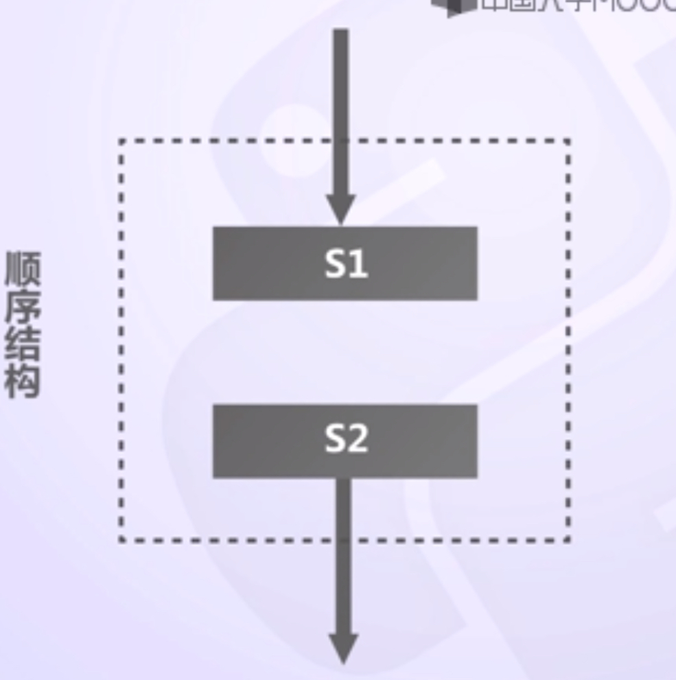
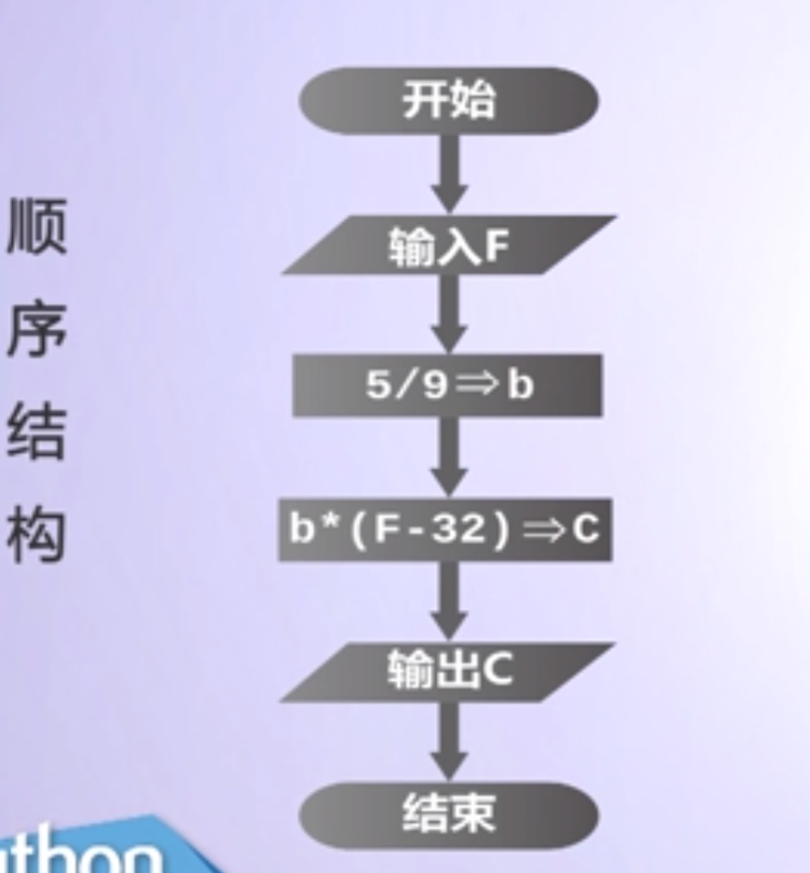
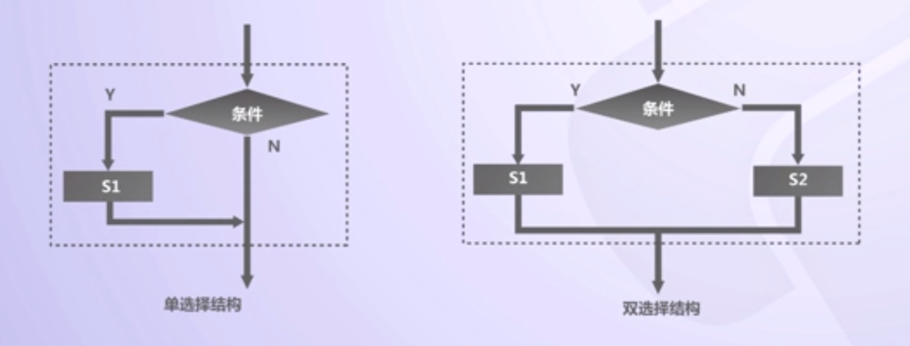
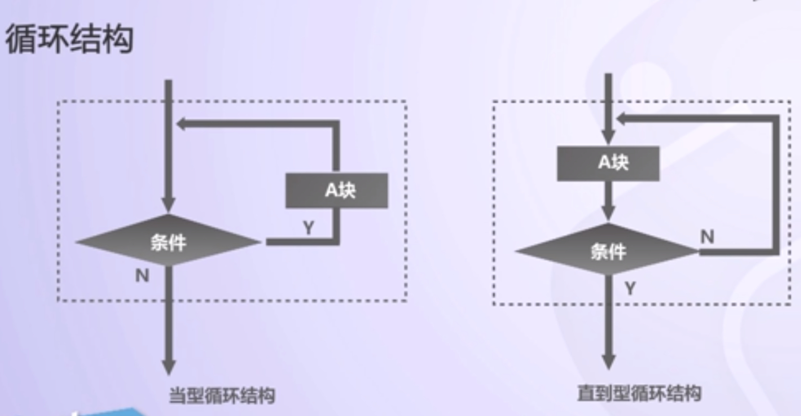
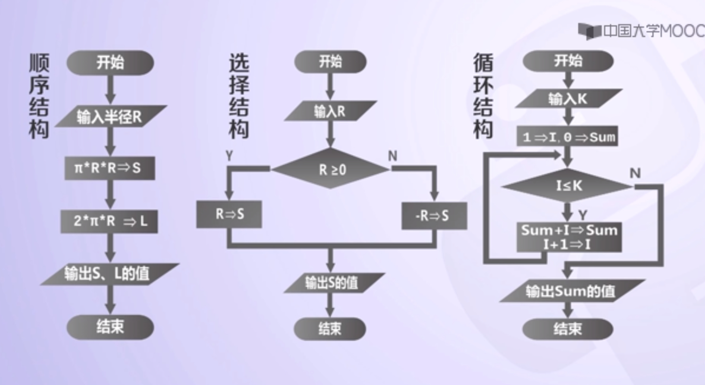

#1.程序基本结构

##1.程序流程图
1. 用规定的一系列图形、流程线和文字说明算法中的基本操作和控制流程；
2. 流程图的基本元素包括：①表示相应操作的框；②带箭头的流程线；③框内外必要的文字说明；

##2.设计程序框图的步骤

1. 用自然语言表述算法步骤；
2. 确定每一个算法步骤所包含的逻辑结构，并用相应的程序框图表示，得到该步骤的程序框架；
3. 将所有步骤的程序框图用流程线连接起来，并加上终端框，得到表示整个算法的程序框图。

【设计程序框图的步骤】

1. 任何算法（程序）都可以由顺序结构、选择结构和循环结构这三种基本结构组合实现；
###2.1. 循序结构：

【注】
1. 规范的程序流程图一定要以圆角矩形框表示开始和结束框；
2. 一个程序流程图通常会有一个开始，可能会有多个结束框。

###2.2选择结构：
1. 选择结构也叫分支结构，是指在算法中通过对条件的判断，根据条件是否成立而选择不同流向的算法结构；

###2.3循环结构：
1. 循环结构是指在一定条件下反复执行某部分代码的操作，是程序设计最能发挥计算机特长的程序结构。
2. 
###2.4
