#1.简单分支

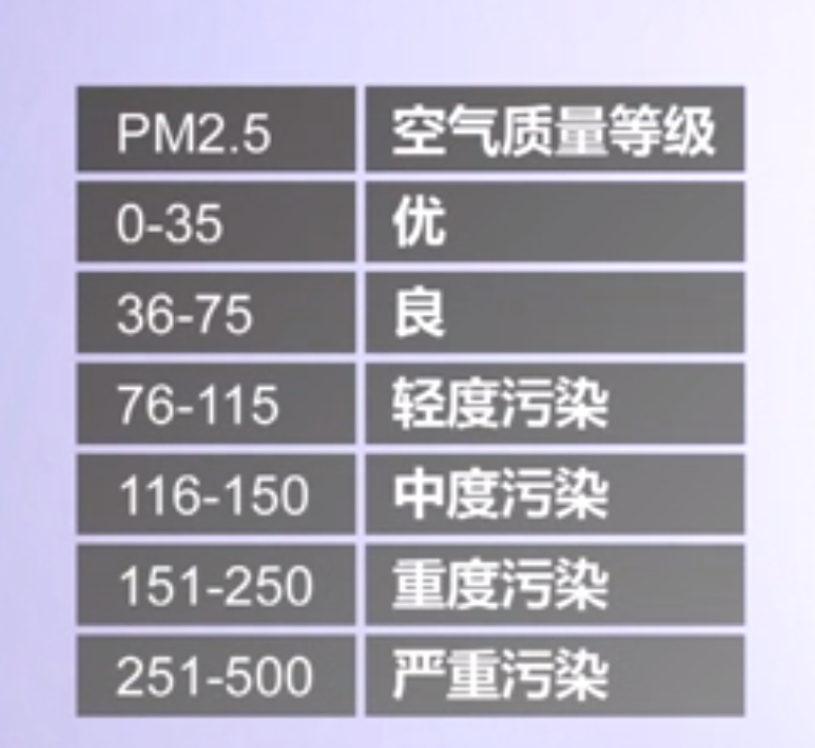

【PM2.5指数分级程序功能IPO模式描述】

1. 输入：接受外部输入PM2.5值；
2. 处理：空气质量分级算法；
3. 输出：打印空气质量提醒。

【PM2.5指数分级伪代码】

1. if PM2.5值>75 打印控制污染警告；
2. if PM2.5值<35 打印空气质量优，建议户外运动。

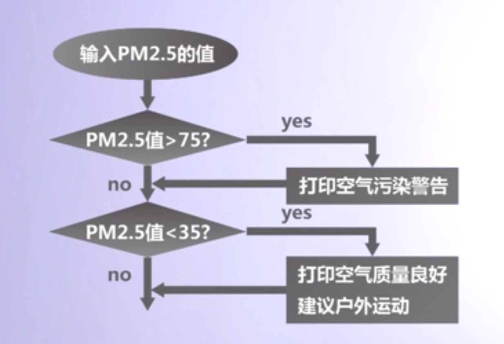

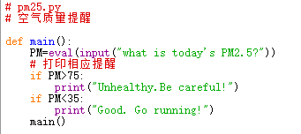

【if语句格式】

if<condition>:
     <body>
1. <condition>是条件表达式；
2. <body>是一个或多个语句序列。

【先判断<condition>条件】

1. true，则执行<body>,再转向下一条语句；
2. false,则直接跳过<body>,转向下一条语句。
3. 
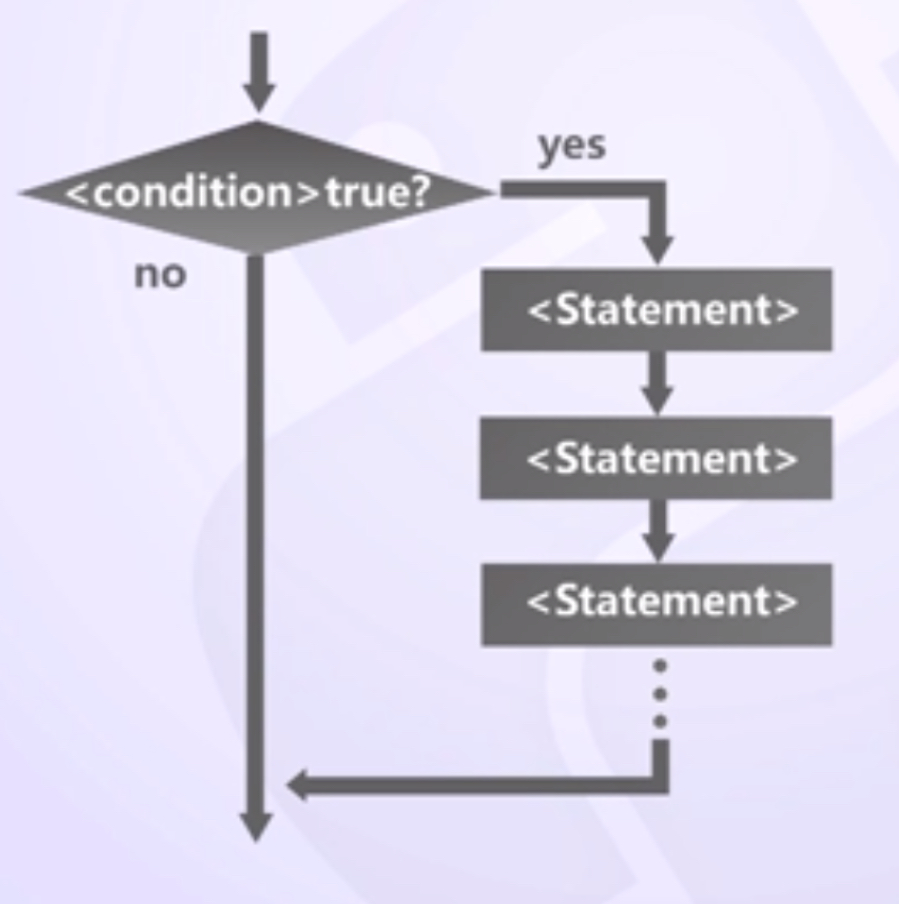

【简单条件构造】
1. 简单条件基本形式<expr><relop><expr>
2. <relop>是关系操作符<,<=,==,>=,>,!=
3. 使用"="表示赋值语句，使用"=="表示等于
4. 除数字外，字符或字符串也可以按照字典顺序用于条件比较
5. <condition>是布尔表达式，为bool类型，布尔值的真和假以字符True和False表示

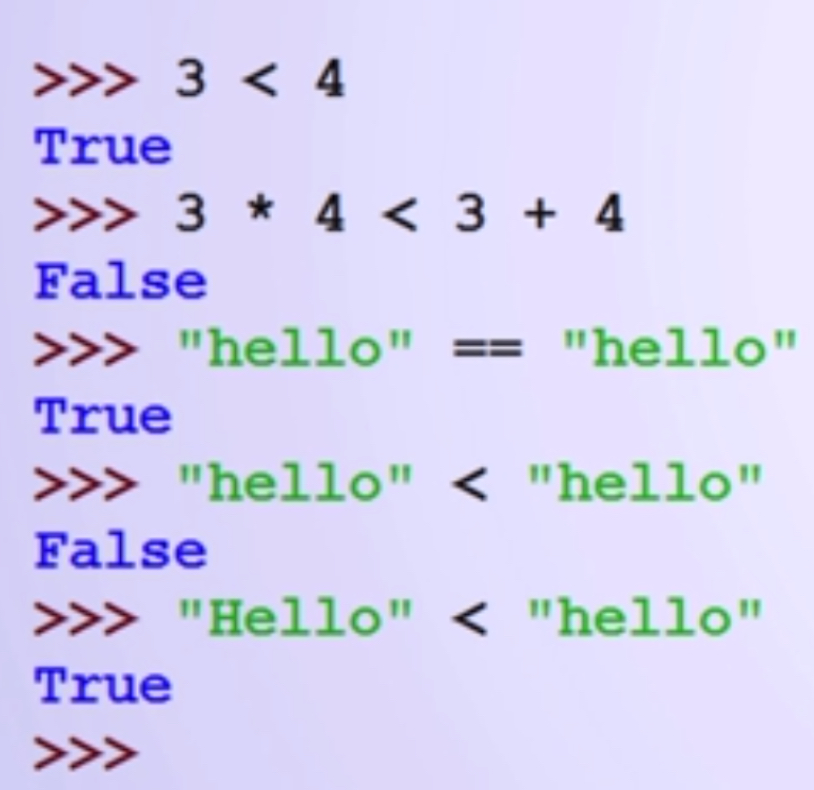
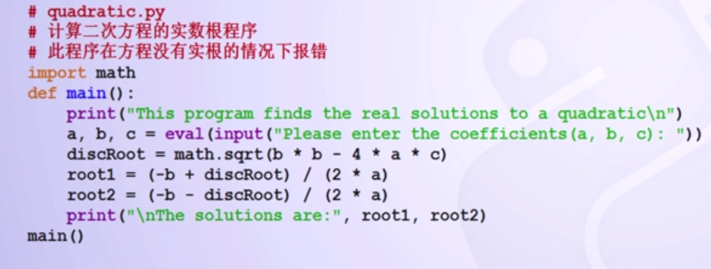
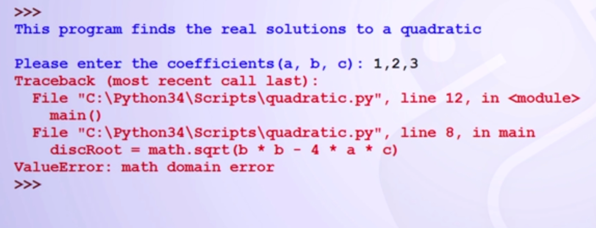

【改版后的程序】

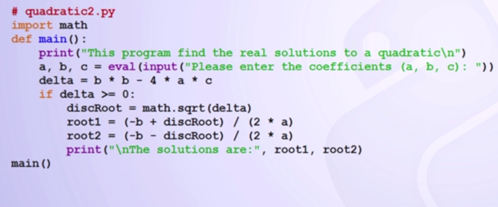

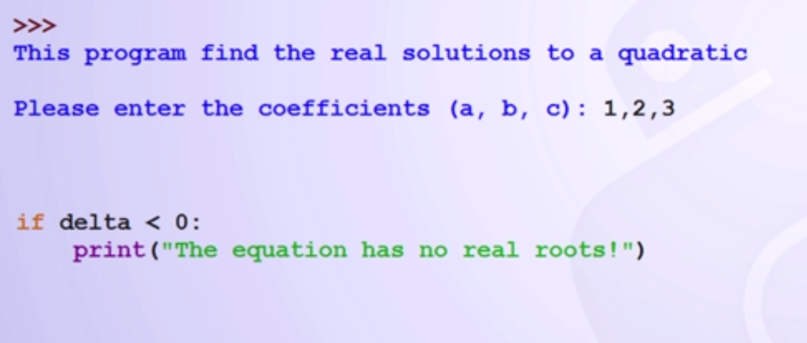

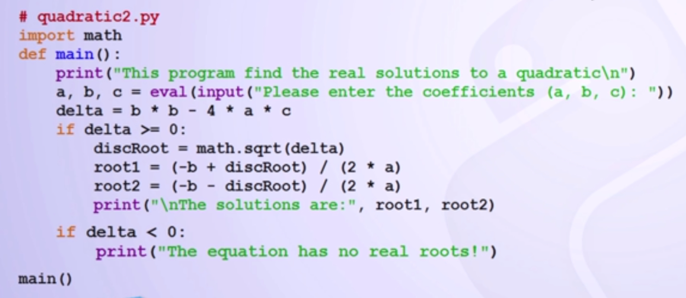

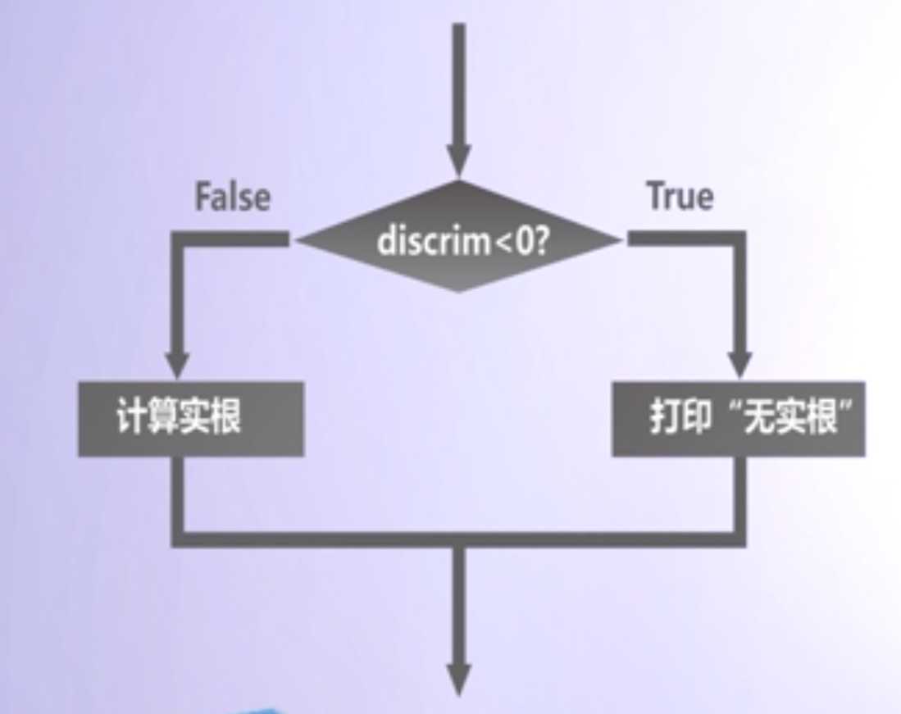

【二分支语法结构】

if<condition>:
    <statements>
else:
    <statements>

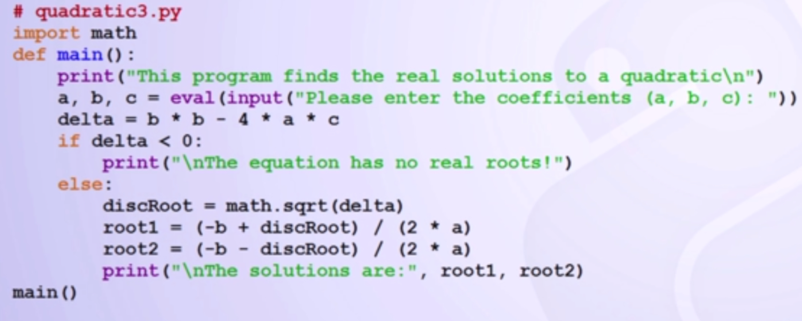

程序结果如下：

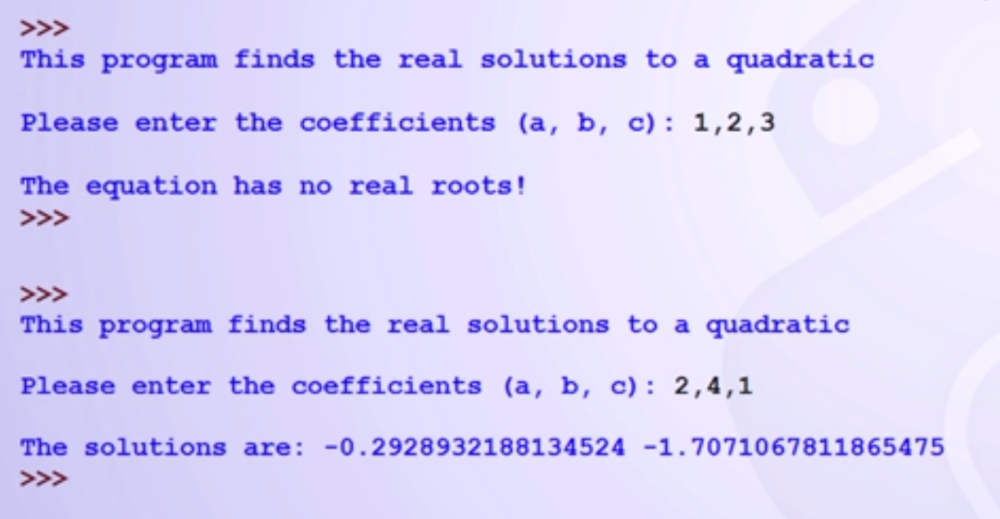