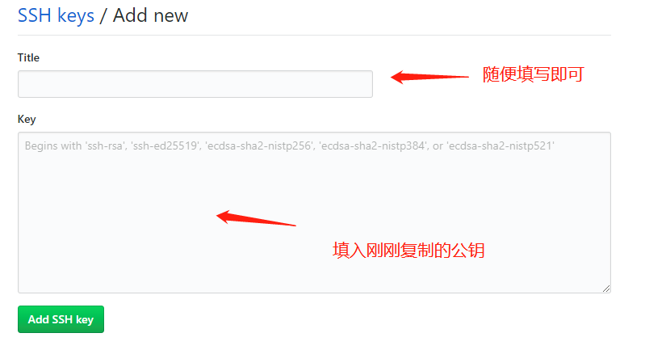
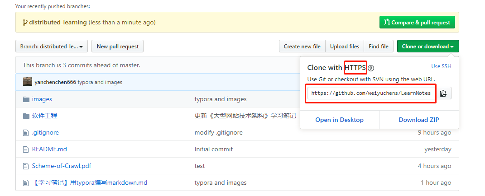
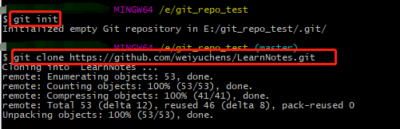
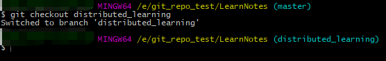
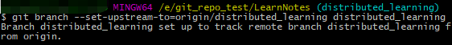
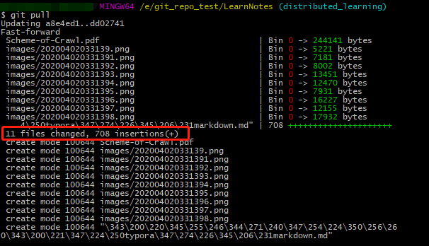
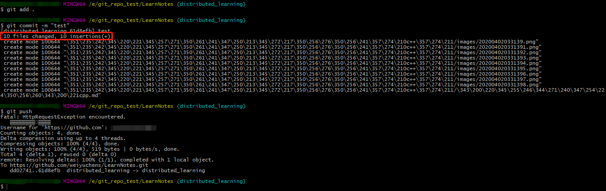
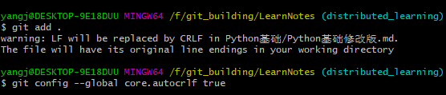

#### 一些资料：

ssh教程链接：https://www.jianshu.com/p/ad59186b6381

改host教程：https://jingyan.baidu.com/article/7908e85cecb8d7af481ad281.html

git简易指南：https://www.bootcss.com/p/git-guide/

全程经验：https://blog.csdn.net/acmman/article/details/77621253

如何把远程仓库的内容clone下来：https://blog.csdn.net/weixin_44538107/article/details/90743245

git 本地分支追踪远程分支：https://blog.csdn.net/qq_39940866/article/details/80320328


## 序言、一些小概念

#### 1、Git
就是最原始的分布式版本控制系统，是开源的。

#### 2、GitHub
与Git不同的是，Git是一个单独的软件，而GitHub是一个网站。众所周知，GitHub是目前最大的版本控制社区网站，用户可以在上面申请账号，并创建自己版本仓库。不过对于免费的仓库，用户必须公开自己仓库中的所有源代码，而付费仓库可以上传私密代码。

#### 3、GitLab
GitLab是一款单独的软件，在Git的基础上搭建起来的Web服务。它可以创建私有库，解决了GitHub的免费仓库必须公开源码的问题。一般的企业或者工作室开发都会选择使用它。


## 一、安装git bash和设置ssh：

​	这里我们先就讲解Git的安装与配置，以及与GitHub的连接。

​	下文以windows环境下的配置为例。

1. 先下载git bash：https://gitforwindows.org/

2. 生成密钥：

   **Windows**：在 Git Bash 中输入命令`ssh-keygen -t rsa`，使用 rsa 算法生成密钥。

   id_rsa 是密钥，id_rsa.pub 是公钥，文件存储在默认目录```C:/用户/本机个人昵称/.ssh```下。

   私钥是本地的，公钥是告诉别人的，通过公钥和私钥的配对，可以完成远端与本地库的连接。

3. 复制公钥：

   * 获取方法1：

     把```C:/用户/本机个人昵称/.ssh```下面的```id_rsa.pub```用记事本打开，复制。

   * 获取方法2：

     快速打开公钥的语句：

     ```
     cd ~/.ssh
     cat id_rsa.pub
     ```

     再复制系统返回的内容。
     
     （Tips：cd指令用来打开.ssh文件夹，cat指令用来显示文件内容。）

4. 在github页面的右上角点击个人头像，选择```'settings'```再点击屏幕左侧的```'SSH and GPG keys'```。

   再点击添加新的ssh：

   

   在弹出的页面进行填写，最后点击绿色按钮提交：

   

5. 如果上不去github，可以改hosts或者挂梯子。

   改host教程：https://jingyan.baidu.com/article/7908e85cecb8d7af481ad281.html

6. 下面在git bash中输入测试上面的公钥是否设置成功的语句： ssh -T git@github.com

   如果此时git bash有询问，那么输入```yes```即可。

   当最后系统输出：

   ```
   Hi '你的github昵称'! You've successfully authenticated, but GitHub does not provide shell access.
   ```

   此时ssh配置成功。

## 二、用clone方式将本地仓库和远程仓库关联

* 在本地一个英文路径下创建一个新文件夹，任意起名，下面以e盘下创建的git_repo_test文件夹为例。

* 我们在git_repo_test文件夹点击右键，选择```'git bash here'```选项，

  当然也可以手动在bash中打开此路径：

  ```
  cd e
  cd git_repo_test
  ```

* 现在初始化本地仓库。命令语句是```git init```。

* 输入语句```git clone + github库网址```，即可把远端仓库clone到本地。

  github网址从项目网址里获取：

  

  复制此链接，然后输入：

  ```
  git clone https://github.com/weiyuchens/LearnNotes.git
  ```

  如图：

  

  这就成功将远端仓库的内容下载部署到本地了。


## 三、本地分支下操作

* 进到本地的git库之后，进到项目的文件夹下，创建一个本地分支。

  比如本次LearnNotes项目的话：

  在gitbash进入到相应文件夹后再输入指令：即在bash进入```/e/git_repo/LearnNotes (master)```路径之后

  即如图彩色部分时再进行操作：***【一定要进到LearnNotes文件夹下啊啊啊啊啊啊啊】***

  

  如果还没进来到文件夹下，那么可以

  * 方式1：

  ```
  cd e
  cd git_repo
  cd LearnNotes
  ```

  * 方式2：

    我们在LearnNotes文件夹点击右键，选择```'git bash here'```选项。

  以上两种方法任选其一，来进入到文件夹下。

  --------------------------

  那么下面我们可以操作了

  * 方式1：

    输入语句：

    ```
      git checkout -b distributed_learning		//创建并切换至新分支
    ```

     当系统回应：```Switched to a new branch 'distributed_learning'```时，分支切换成功.

  * 方式2：

      ```
      git branch distributed_learning			//创建新分支
      ```

      再

      ```
      git checkout distributed_learning			//切换至新分支
      ```


  如图：

  

  

  ​	由蓝色字样，可知分支已经从master切换至distributed_learning。

* 设置远程跟踪：***【一定要进到LearnNotes文件夹下啊啊啊啊啊啊啊】***

  ```
  git branch --set-upstream-to=origin/distributed_learning distributed_learning
  						//设置本地分支master跟踪origin/<branch>远程分支
  ```

  如图：

  

* 要更新你的本地仓库至最新改动，即将远端仓库的更新同步到本地，执行：
  `git pull`

  如图：

  

  出现如图提示，即说明pull远端内容成功。

  **PS.** 如果pull不下来，并且报错403，请先去找负责人进行github账户在项目下的授权。报上githhub昵称，之后在邮箱接受项目邀请即可。
  
* ```
  暂时不用管的几个tips：
  1、master是主分支，还可以建一些其他的分支用于开发。
  2、git push origin master的意思就是上传本地当前分支代码到master分支。git push是上传本地所有分支代码到远程对应的分支上。
  ```

* 最后把本地的库push到远端（**记住每次push之前一定要确保已经把远端的最新库pull下来了才行**）：

  ```
  git add .				//别忘了这个点，没错，不是你的屏幕脏了！！
  git commit -m "all"		//双引号里输入文档注释内容，可以是本次提交的描述
  git push				//从本地向远端仓库上传内容，此时可能要求输入git账号和密码，如实输入即可
  ```

  如图：

  

  此时说明已经push成功。

  以后下载和上传文件按照上图pull和push的方法即可。

## 四、报错答疑

1.错误代码

```
error: RPC failed; curl 56 OpenSSL SSL_read: SSL_ERROR_SYSCALL, errno 10054
```

错误原因：下载速度不够

2.上传时报错



解决办法：https://www.jianshu.com/p/450cd21b36a4


