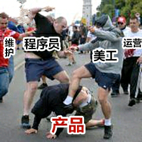

# 学习笔记：关于产品

> 作者：chen
>
> 邮箱：weicynku@163.com

## 一、开卷暴击

这究竟是人性的灭绝，还是道德的沦丧？

下面《走进产品》即将为你讲述——

## 二、产品经理是什么

#### 1、产品经理（Product Manager）的职责：

* 企业中专门负责产品管理的职位
* 产品经理负责市场调查并根据产品、市场及用户等的需求，确定开发何种产品，选择何种业务模式、商业模式等
* 推动相应产品的开发组织
* 要根据产品的生命周期，协调研发、营销、运营等，确定和组织实施相应的产品策略
* 其他一系列相关的产品管理活动

#### 2、产品经理和项目经理的区别

> 参考资料：http://www.woshipm.com/pd/146.html

#### 3、产品经理和市场经理的区别

> 参考资料：http://www.woshipm.com/pmd/1227368.html

#### 4、产品经理和产品运营经理的区别

> 参考资料：http://www.woshipm.com/pmd/154542.html

对于产品和运营分开的公司来说，有个很简单的区分：**产品是生孩子，运营是养孩子。**

**产品**的职责，是需求分析、市场分析、竞品调研、用户调研、交互设计、原型及文档等这些“看不见”的工作，基本上，很少出现在产品第一线。基本上围绕的是“需求”。

而**运营**，是直接面对用户的一线作战人员，推广、渠道、营销，所做的全是围绕“用户”这个目标来做。

**让我们来看两个区别：**

某公司招聘产品经理的职位说明：

搜集一下相关关键词：

> 市场及用户研究、产品规划及设计、产品版本管理、开发及项目管理、解决产品运营相关问题和数据分析

我们再来看看，同一个公司招聘产品运营经理的职位说明：

同样，搜集一下相关关键词：

> 运营规划、营销规划、商务合作、媒介传播、数据分析和市场监控

看出来没？

> 产品经理，更偏重于产品，围绕“需求”这一目标。
>
> 运营经理，更偏重于运营，围绕“用户”这一目标。

## 三、产品全流程剖析

> 参考资料：http://www.woshipm.com/pd/3040283.html

人机交互与产品设计已经在西方国家发展了半个多世纪，已经研究出了相当多的方法理论。国内跟进没有很久，再加上前几年野蛮生长，导致很多人对这一领域缺乏系统认知。

**在国际上被广为认可的，而且在国内具有一定可行性的产品设计流程**。

### （一）大纲目录

#### 【1】准备阶段

**1. 定性研究**Qualitative Research，针对可能使用你的产品的人，可以是问卷、访谈…

**2. 确定人物角色**Persona，即产品的典型用户，可以有一种或几种。

**3. 问题脚本**Problem Scenario，罗列人物角色在使用产品时可能遇到的问题，可以整理成一个故事便于别人理解。

**4. 动作脚本**Action Scenario，像写故事一样，写人物角色在使用你设计好的产品时，发生的细节。注意，这个时候你的产品概念模型已经基本成型了，这个概念模型是通过解决问题脚本里的问题而得出的。

#### 【2】输出阶段

**5. 画线框图**Wireframe，这个线框图是通过把动作脚本里的概念模型转化成视觉模型得到的。

**6. 交互原型**Prototype，做出来好像可以用的东西，有很多原型工具可以利用。

#### 【3】评测阶段

**7. 专家评测**Expert Evaluation，至少两名设计师或对交互设计比较了解的人通过反复测试原型。找到问题后修改线框图并更新原型。

**8. 用户评测**User Evaluation，让用户使用原型，可以给他们一些任务去完成。根据用户在使用过程中的问题和建议进行进一步修改。

### （二）方法

#### 1. 定性研究 Qualitative Research

无论你用何种形式做调查，你的目的是了解用户的五个方面。假设体验进阶公众号是一款产品：

1. **行为**Activities，例如用户多久打开一次体验进阶、一次阅读多久？
2. **态度**Attitudes，例如：用户怎样看待体验进阶？
3. **资质**Aptitudes，例如：体验进阶用户的学历背景怎样？
4. **动力**Motivation，例如：体验进阶用户为什么使用该产品？
5. **技能**Skills，例如：用户对同类产品或平台设备是否熟悉？

#### 2. 人物角色 Persona

如果你的定性研究有所成功，这时你应该对你的用户有所了解了。

根据上文中的五个方面，你需要挑拣出最典型的一个或几个形象。例如体验进阶读者的人物角色可能有：刚上路的设计新人、具有探索欲的产品经理、寻找转型方向的UI设计师……

你不但要确定这些人物角色（Persona）的主要特点，还要确定他们的需求和目的。为了增加真实性，可以给人物角色（Persona）取名字，选一张照片，细化他们的背景资料。

以下是范例：

上图来源：https://dribbble.com/shots/6197926-Persona

上图来源：https://dribbble.com/shots/4864252-Woman-User-Persona-UX

#### 3. 问题脚本 Problem Scenario

基于你对人物角色（Persona）的理解，你应该已经可以设想出他们在使用产品中可能遇到的问题了。

你可以为每一个人物角色列一个问题单，也可以把它们整理到一个简短的故事里。

以下是一个案例：

> Macomb 先生和夫人都是退休老师，现在已经60多岁了。他们的社会保障支票是他们收入的重要组成部分。他们刚刚卖掉了自己的大房子，搬到一间小公寓里。
>
> 他们知道，他们现在需要做的许多杂事之一就是告诉社会保障局他们已经搬家了。他们不知道最近的社会保障处在哪里，而且他们走路或开车越来越困难。
>
> 如果足够简单和安全，他们希望使用计算机将其举动通知社会保障局。但是，他们对于通过计算机执行这样的任务有些担心。他们从未在工作中使用计算机。
>
> 然而，他们的儿子 Steve 去年给了他们一台计算机，为他们安装了计算机，并向他们展示了如何使用电子邮件和访问网站。
>
> 他们从未去过社会安全管理局的网站，所以他们不知道它的组织方式。此外，他们也不愿在线提供个人信息，因此他们想知道以这种方式告诉代理机构新地址的安全性。

上文来源：https://www.usability.gov/how-to-and-tools/methods/scenarios.html

#### 4. 动作脚本 Action Scenario

首先你要为已列出的问题想好可能的解决方案，然后写一个简短的故事把这些解决方案囊括进去。写成故事的好处是代入感较强，对别人来说容易理解。国内比较推崇故事版，但是把所有情景画出来的效率是非常低的。

在画设计之前把用户动作通过文字脚本写出来有一个很大的好处，那就是明确了主要的用户路径。

以下是一个案例：

> 约瑟夫在他的办公室，需要为他的商务会议预定一家酒店，该酒店将在纽约举行。商务会议将在四天内举行。
>
> 他很忙，由于他还有很多其他工作要做，因此需要在他逗留期间尽快找到一个可以睡觉的地方。
>
> 他打开我们的网站，知道他想去的城市的日期和名称。看到很多条目后，他注意到他想在中心附近的一家旅馆里住，因为客户会议将在该地区举行。他还需要满足其他条件：靠近地铁站，附近有一些餐馆。
>
> 他找到了一个地方并将其预订。
>
> 他收到确认。

上文来源：https://medium.com/@Kristijan197/hci-method-user-groups-and-scenarios-8904ad706e93

#### 5. 画线框图 Wireframe

这个时候你对你的交互方案已经有了一个比较抽象的想法了，现在只要把它具象化就好了。线框图大家都比较了解，这里就不多说了。

上图来源：https://dribbble.com/shots/6194759-Upshift-wireframe/attachments

上图来源：https://dribbble.com/shots/7084851-CRM-System-UX-Process

其实线框图不一定很糙，有的人甚至喜欢直接上色开始视觉。

#### 6. 交互原型 Prototype

如果是比较重要的项目，可以叫上开发一起来灰度测试。但是即便是这样，也建议设计稿出来后，就可以立即做一个底成本的交互原型。

可以使用的原型工具还是很多的，例如 Axure RP 、 InVision 等。即便没有专业工具，用 PPT 也可以搞出来，只要做出一个可以交互的东西就行了。

一个原型是不可能实现所有功能的，所以你要确定几个可以走通的功能，让给用户能够顺利在指定路径上完成一系列任务。

上图来源：https://dribbble.com/shots/4757077-Newslist-Interactions

#### 7. 专家评测 Expert Evaluation

原型完成后召集至少两三个设计师或者对交互比较了解的人，使用并评测原型。你可以将原型所关注的几个任务列出来，以免专家不知道原型哪部分可交互哪部分不可交互。

比较常用的评测方法是**启发式评估法（Heuristic Evaluation）**，而这种方法比较常见的标准是**尼尔森交互设计法则（Nielsen Heuristic）**:

1. 系统状态是否可见 Visibility of system status
2. 系统是否符合现实世界的习惯 Match between system and the real world
3. 用户是否能自由地控制系统 User control and freedom
4. 统一与标准 Consistency and standards
5. 错误防范 Error prevention
6. 减轻低用户的记忆负担 Recognition rather than recall
7. 灵活性和效率 Flexibility and efficiency of use
8. 美观简洁 Aesthetic and minimalist design
9. 帮助用户认知、了解错误，并从错误中恢复 Help users recognize, diagnose, and recover from errors
10. 帮助文档 Help and documentation

**如何使用启发式评估法？**

1. 列出问题：专家们各自将自己发现问题列出来，并将之与对应的法则相关联，或者根据法则来查找问题。例如“系统状态是否可见”在这一条产品上是否体现完善，有哪些问题？
2. 各自评估：然后专家们分别给自己的问题进行分级，大家要使用统一的标准；
3. 统一讨论：专家们把问题整合起来一起讨论，遇到意见不统一的适合投票表决或者采用平均值。

评级标准非常多，你也可以设计自己的标准。我认为比较简单好用的是 Jeff Robin **问题分级**：

- 4级 ·致命问题：无法使用产品的某一部分
- 3级 · 重度问题：难以完整使用产品的某一部分
- 2级 · 中度问题：大部分情况下能够使用，但需要付出较大努力
- 1级 ·轻度问题：偶尔发生且容易解决，或者问题并不在产品的主要功能上

> 提醒：评测完后别忘记依据问题的重要程度修改优化设计稿和原型！

#### 8. 用户评测 User Evaluation

原型通过专家评测后，你可以找一些典型用户使用原型。你可以把任务列给他们，让他们自己尝试完成任务。中间遇到的问题可以记录下来，设计师通过观察来进行评分。

用户最好是寻找符合人物角色（Persona）的目标人群和真实用户，这样得出的结论是最可靠的。不过，大多数情况下，产品的可用性问题都是“功能隐藏太深”、“文字描述不清晰”等通俗问题，一般人也能作为用户在测试中发现足够多的问题。

比较常用的用户评测方法是可用性测试：

1. **完成任务：**让用户根据一张任务列表使用产品；
2. **记录问题：**一名观察员在旁观察记录问题；
3. **填写问卷：**用户完成任务后，填写问卷；
4. **整理问题：**整理记录下来的问题并分类分级。

除此之外，也有很多其它方式，例如 Focusing Group 、Think Aloud 和 Probing 等，但核心都离不开可用性问题。

那么，还有一个问题，需要多少用户才能做评测呢？怎么也要几十上百个？其实**只要五名用户就可以发现80%的可用性问题**。

如果你不相信，尼尔森在2000年就做过实验，有数据为证：

数据来源：https://www.nngroup.com/articles/why-you-only-need-to-test-with-5-users/

有趣的是，用户评测的结果可能和专家评测的结果相差很远。我以设计师都身份做过很多次可用性测试，每次都能发现意想不到的问题，因为用户视角和设计视角完全不同。

> 再次提醒：每次评测完后都要依据问题的重要程度修改优化设计稿和原型！

### （三）总结

这个流程也不是单线程的。其中有些步骤，仅仅只是为了进行下一步；另外一些，却会对后面好几个步骤产品影响。有几个环节，是又是可以循环好几轮来优化方案。

不过，这些东西很难用文字表述出来，最好是自己在实践中体会。如果一定要展现出来给大家看看，那就是下面这张流程图了：

**用户则是检验产品体验的唯一标准**。