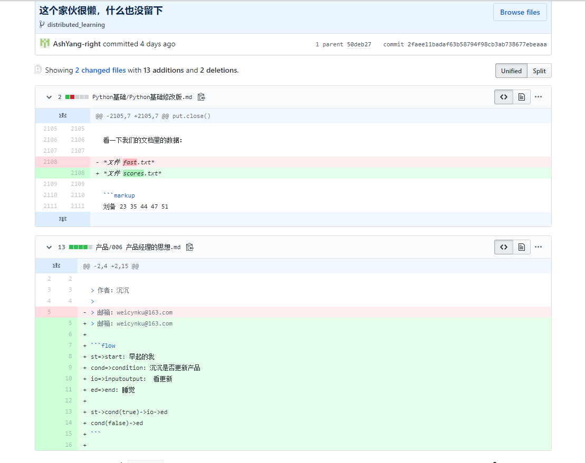

产品经理的思想

> 作者：沉沉
>
> 邮箱：weicynku@163.com

```flow
st=>start: 早起的我
cond=>condition: 沉沉是否更新产品
io=>inputoutput:  看更新
ed=>end: 睡觉

st->cond(true)->io->ed
cond(false)->ed
```


沉沉：哈哈哈哈哈哈哈哈哈哈哈我裂开，上面这个真的是好活儿，谁留下的哈哈哈哈哈？杨总？哈哈哈哈哈哈哈哈哈？我不更新就直接睡觉？恩？[doge]


沉沉：破案了[doge]

