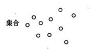
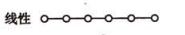
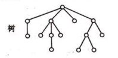
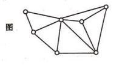

# 数据结构——绪论

## 1、什么是数据结构

### （1）背景

> + 为了编写出好的程序，必须分析待处理的对象的特性以及各处理对象之间的关系.
>
> + 用计算机解决一个具体问题时，需经过以下几个步骤：
>
>   > > 1、从具体问题抽象出一个适当的数学模型
>   > >
>   > > 2、设计一个解决此数学模型的算法
>   > >
>   > > 3、编出程序，进行测试、调整直至得到最终的答

### （2）定义
> + 数据结构是一门研究非数值计算的程序设计问题中计算机操作对象以及它们之间的关系和操作等的学科

## 2、基本概念和术语

> + **数据（data）**：是对客观事物的符号表示，在计算机科学中是指所有能输入到计算机中被计算机程序处理的符号的总称。*（例如：数字、字符串、图像、声音等可通过编码归之于数据的处理对象）*
>
> + **数据元素（data element）**：是数据的基本单位，在计算机中通常作为一个整体进行考虑和处理。
>
>   > > 一个数据元素可由若干个**数据项（data item）**组成，数据项是数据不可分割的最小单位。
>
>   > > *（例如：一本书的书目信息为一个数据元素，而书目信息中的每一项（如书名、做作者名等）为一个数据项）*
>   
> + **数据对象（data object）**：是性质相同的数据元素的集合，是数据的一个子集。*（例如：字母字符数据对象是集合C={‘A’,‘B’,...，‘Z’,}）*
> 
> + **数据结构（data structure）**：是相互之间存在一种或多种特定关系的数据元素的集合。
>
>   数据元素相互之间的关系称为**结构（structure）**。根据数据元素之间关系的不同特性，通常有下列四类基本结构：
>   >  >|名称|定义|关系图|
>   >  >|----|----|----|
>   >  >|集合|结构中数据元素处理“同属于一个集合”的关系外，别无其他关系||
>   >  >|线性结构|结构中的数据元素之间存在一个对一个的关系*（即1 对 1）*||
>   >  >|树形结构| 结构中的数据元素之间存在一个对多个的关系*（即1 对 N）*   ||
>   >  >|图（网）状结构|结构中的数据元素之间存在多个对多个的关系*（即N对 N）*||
>   > 
>   > 数据结构是一个二元组：Data_Structure=(D,S),其中D是数据元素的有限集，S是D上关系的 有限集。
>   >  > *例如：为课题小组设计一个数据结构，假设每一个小组由1位教师，1~3名研究生及1~6名本科生组成，小组成员之间的关系是：教师指导研究生，而由每位研究生指导一到两名研究生。则可定义数据结构：Group=（P，R），用T表示导师，G表示研究生，S表示大学生，则有如下关系：
>   > > 
>   > > > P={T,G1,...,Gn,S11,...,Snm}(1≤n≤3,1≤m≤2)
>   > > > R={R1,R2}
>   > > > R1={<T,Gi>|(1≤i≤n,1≤n≤3)}
>   > > > R2={<Gi,Sij>|(1≤i≤n,1≤j≤m,1≤n≤3,1≤m≤2)}*
>   > 
>   >   数据结构中的关系描述称为数据的逻辑结构。
>   >   数据结构在计算机中的表示（映像）称为数据的物理结构。

> + **数据类型（data type）**：是一个<u>值的集合</u>和定义在这个值集上的<u>一组操作</u>的总称。按“值”的不同特性，可分为两类：
>   > > 1、非结构的原子类型：值不可分解*（例如：整型、字符型、指针类型等）*
>   > > 2、结构类型：值是由若干成分按某种结构组成的，值可分解*（例如：数组）*
>
> + **抽象数据类型（Abstract Data Type，简称ADT）**：是指一个数学模型以及定义在该模型上的一组操作。抽象数据类型的定义取决于它的逻辑结构，而与其在计算机内如何表示和实现无关。按其值的不同类型可分为3种类型：
>   > > 1、原子类型(atomic data type)：该类型的变量值是不可分解的。*（例如：数位为100的整数）*
>   > > 2、固定聚合类型(fixed-aggregate data type)：该类型的变量，其值由确定数目的成分按某种结构组成。*（例如：复数是由两个实数依确定的次序关系构成）*
>   > > 3、可变聚合类型(variable-aggregate data type)：该类型的变量，其值的数目不确定。*（例如：数组的长度是可变的）*
>   > > 
>抽象数据类型可用三元组表示（D,S,P），D是数据类型，S是D上的关系集，P是对D的基本操作集
> 
> + **多形数据类型（polymorphic data type）**：是指其值的成分不确定的数据类型。*（例如：数据类型中的元素可以是整数或字符或字符串）*
## 3、算法和算法分析
> + **算法(algorithm)**：是对特定问题求解步骤的一种描述，是指令的有限序列，其中每一条指令表示一个或多个步骤。算法具有以下5个特性：
>   > 1、有穷性：在执行有穷步后结束，且每一步都可在又穷时间内完成
>   > 2、确定性：每一条指令都有确定的含义，不会产生二义性
>   > 3、可行性
>   > 4、输入
>   > 5、输出

> + **算法设计的要求**：
>   >1、正确性：
>   > >a.程序不含语法错误  
>   > >b.对普通输入数据能满足规格要求说明的结果
>   > >c.对刁难型输入数据能满足规格要求说明的结果（通常以达到c层作为合格衡量标准）
>   > >d.对一切合法输入数据能满足规格要求说明的结果（数据量过大，达到该层极为困难）
>   > 
>   > 2、可读性
>   > 3、健壮性：当输入数据非法时，算法能做出适当处理，不会产生奇怪的输出结果
>   > 4、效率与低存储量需求：效率指算法执行时间，。存储量需求指算法之心过程中所需要的最大存储空间。

>+ **算法效率的度量**：
>   > 1、事后统计法
>   > 2、事前分析估算法（常用）：从算法中选取一种对于所研究问题来说是基本操作的原操作，以该基本操作重复执行的次数作为算法的时间量度。算法的时间量度记作：T(n)=O(f(n))，即时间复杂度，其中n为问题的规模。
>   >
>   > >a.{++x;s=0;}     —>"x++"语句频度[^语句频度]为1  —>时间复杂度为O(1)
>   > >b.for(i=1;i<=n;i++){++x;s+=x;}   —>"x++"语句频度为n  —>时间复杂度为O(n)
>   > >c.for(i=1;i<=n;i++)
>   > >
>   > >>for(k=1;k<=n;k++){++x;s+=x;}   —>"x++"语句频度为n2  —>时间复杂度为O(n2)
>   > >
>   > >[^语句频度]:该语句重复执行的次数
>   > (在难以精确计算语句频度的情况下，只需求出关于n的增长率即可。通常，分析最坏情况下的时间复杂度是更可行更常用的方法)

>   + **算法的存储空间需求**：
>   以空间复杂度作为算法所需存储空间的量度，记作：S(n)=O(f(n))，其中n为问题的规模。
